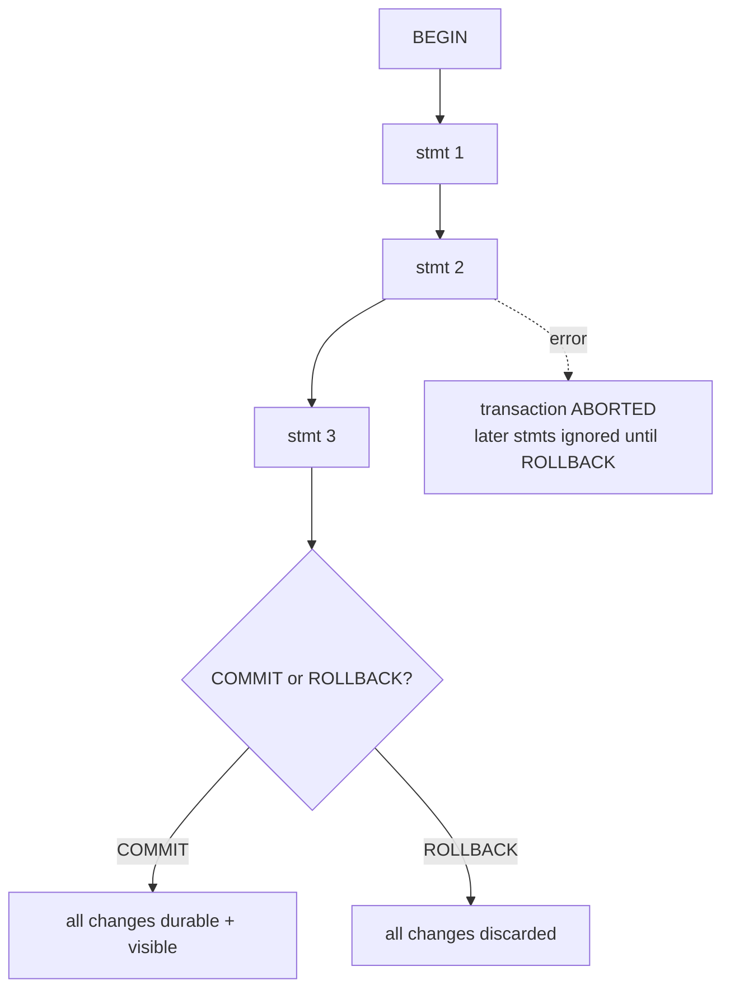

{/* status: authored */}

export const schema = `CREATE TABLE accounts (
  id   text PRIMARY KEY,
  balance numeric NOT NULL CHECK (balance >= 0)
);
INSERT INTO accounts VALUES ('alice', 100), ('bob', 20);`;

# Transactions & ACID

## First principles

A **transaction** groups statements into one unit that either **all commit** or
**all roll back**. `BEGIN` starts one; `COMMIT` makes it permanent and visible;
`ROLLBACK` discards it. Outside an explicit `BEGIN`, each statement is its own
auto-committed transaction.

**ACID** is what a transaction guarantees:

| Letter | Guarantee | If it were missing |
|---|---|---|
| **Atomicity** | all statements land, or none do | a transfer debits Alice, crashes, never credits Bob |
| **Consistency** | every constraint holds at `COMMIT` | a write leaves `balance` negative |
| **Isolation** | concurrent transactions don't see each other's uncommitted work | you read half of someone's transfer — [next topic](/foundations/isolation-levels-and-mvcc) |
| **Durability** | a committed change survives a crash / power loss | `COMMIT` returns, server reboots, money gone |

**Savepoints** are nested rollback points inside a transaction:

```sql
BEGIN;
  UPDATE accounts SET balance = balance - 30 WHERE id = 'alice';
  SAVEPOINT after_debit;
  UPDATE accounts SET balance = balance + 30 WHERE id = 'carol';  -- carol doesn't exist
  -- 0 rows; or an error -> 
  ROLLBACK TO SAVEPOINT after_debit;   -- undo just the credit attempt
  UPDATE accounts SET balance = balance + 30 WHERE id = 'bob';
COMMIT;
```

**Aborted state**: once a statement in a transaction errors, Postgres puts the
whole transaction in "aborted" — every further statement returns `ERROR: current
transaction is aborted, commands ignored until end of transaction block` until
you `ROLLBACK` (or `ROLLBACK TO` a savepoint).

## The mechanism



## Hand-trace on dummy data

A transfer of 30 from Alice to Bob, atomic:

<QueryTrace
  caption="both updates commit together; a failure anywhere rolls back the debit too"
  steps={[
    {
      title: "1 · accounts",
      table: { name: "accounts", columns: ["id", "balance"], rows: [["alice",100],["bob",20]] },
    },
    {
      title: "2 · BEGIN; UPDATE alice -30  (uncommitted — others still see 100)",
      op: "balance",
      table: { columns: ["id", "balance (in txn)", "visible to others"], rows: [["alice",70,"100"],["bob",20,"20"]] },
    },
    {
      title: "3 · UPDATE bob +30  (still uncommitted)",
      op: "balance",
      table: { columns: ["id", "balance (in txn)", "visible to others"], rows: [["alice",70,"100"],["bob",50,"20"]] },
    },
    {
      title: "4 · COMMIT — both land atomically; now everyone sees the new values",
      op: "balance",
      table: {
        name: "accounts (after COMMIT)",
        result: true,
        columns: ["id", "balance"],
        rows: [["alice",70],["bob",50]],
      },
    },
  ]}
/>

If the process died between steps 2 and 4, **atomicity + durability** mean Alice
is back at 100 on restart — the transaction never committed.

## Run it

<SqlRunner title="atomic transfer" setup={schema}>
{`BEGIN;
UPDATE accounts SET balance = balance - 30 WHERE id = 'alice';
UPDATE accounts SET balance = balance + 30 WHERE id = 'bob';
COMMIT;
SELECT * FROM accounts ORDER BY id;`}
</SqlRunner>

<SqlRunner title="rollback undoes everything" setup={schema}>
{`BEGIN;
UPDATE accounts SET balance = 0 WHERE id = 'alice';
UPDATE accounts SET balance = 999 WHERE id = 'bob';
ROLLBACK;
SELECT * FROM accounts ORDER BY id;   -- 100 / 20, untouched`}
</SqlRunner>

<SqlRunner title="consistency: a constraint aborts the whole transaction" setup={schema}>
{`BEGIN;
UPDATE accounts SET balance = balance - 200 WHERE id = 'alice';  -- CHECK balance >= 0 fails
-- from here the txn is aborted:
SELECT * FROM accounts;   -- ERROR: current transaction is aborted
ROLLBACK;
SELECT * FROM accounts ORDER BY id;   -- unchanged`}
</SqlRunner>

<SqlRunner title="savepoints: partial rollback" setup={schema}>
{`BEGIN;
UPDATE accounts SET balance = balance - 30 WHERE id = 'alice';
SAVEPOINT debited;
UPDATE accounts SET balance = balance + 30 WHERE id = 'carol';  -- 0 rows (no carol)
ROLLBACK TO SAVEPOINT debited;      -- keep the debit, drop the bad credit
UPDATE accounts SET balance = balance + 30 WHERE id = 'bob';
COMMIT;
SELECT * FROM accounts ORDER BY id;`}
</SqlRunner>

<RunThis file="sql/foundations/25_transactions_and_acid/topic.sql" />

## Build → Break → Fix → Why

:::tip 🔨 Build
Wrap the two-step transfer in `BEGIN ... COMMIT` so it's atomic.
:::

:::danger 💥 Break
Run the two `UPDATE`s without a transaction (autocommit):

```sql
UPDATE accounts SET balance = balance - 30 WHERE id = 'alice';   -- commits
-- app crashes / network dies here
UPDATE accounts SET balance = balance + 30 WHERE id = 'bob';     -- never runs
```

Alice is out 30; Bob never got it. The money is gone.
:::

:::note 🔧 Fix
`BEGIN; UPDATE ...; UPDATE ...; COMMIT;` — now the debit is invisible and
reversible until the credit also succeeds, and both become durable together. In
application code, one transaction per business operation, with a rollback on any
exception.
:::

:::info 🧠 Why it behaved that way
Autocommit makes each statement its own transaction, durable the instant it
returns. There's no unit spanning both updates, so a failure after the first
leaves the database in a state your business rules call invalid — but which no
*single* constraint forbids. Atomicity is exactly the guarantee that
multi-statement invariants hold: the group is indivisible.
:::

## Pitfalls & idioms

- **One transaction per logical operation.** Not per statement, not per HTTP
  request-that-does-five-things-unrelated.
- After an error mid-transaction you must `ROLLBACK` (or `ROLLBACK TO`) —
  everything else is ignored. Frameworks usually do this for you; know that
  they do.
- Keep transactions **short**. A long-open transaction holds locks and blocks
  `VACUUM` from cleaning old row versions (bloat).
- Don't do slow external I/O (HTTP calls, emails) inside a DB transaction — you
  hold locks for the round-trip.
- `SAVEPOINT` for "try this, undo just this part on failure" — e.g. per-row in a
  batch import.
- DDL (`CREATE TABLE`, `ALTER`) **is transactional** in Postgres — migrations can
  roll back. (Not in MySQL.)
- Durability assumes `fsync` is on and your disk isn't lying. `synchronous_commit
  = off` trades a few ms of committed data on crash for throughput — a real
  choice, made deliberately.

## See also

- [Isolation levels & MVCC](/foundations/isolation-levels-and-mvcc) — the "I", in detail
- [Modifying data](/foundations/modifying-data) — the statements you group
- [Constraints & keys](/foundations/constraints-and-keys) — the "C", and deferred checks
- [Backend → Reading EXPLAIN plans](/backend/reading-explain-plans-and-query-optimization) — why long transactions hurt

## Check yourself

1. One line each: what does A, C, I, D guarantee?
2. What state is a transaction in after a statement errors, and how do you get
   out of it?
3. `SAVEPOINT` — what problem does it solve that `BEGIN`/`ROLLBACK` alone
   doesn't?
4. Why are long-running transactions bad even if they eventually commit?
5. Autocommit: a two-statement transfer, the process dies between them. What's
   the resulting state and which ACID property was violated?
