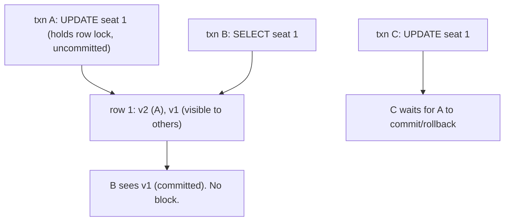

{/* status: authored */}

export const schema = `CREATE TABLE seats (
  seat_id int PRIMARY KEY,
  held_by text
);
INSERT INTO seats VALUES (1, NULL), (2, NULL), (3, 'ana');`;

# Isolation levels & MVCC

## First principles

**MVCC (Multi-Version Concurrency Control)**: instead of locking rows for reads,
Postgres keeps **multiple versions** of each row. Every transaction sees a
**snapshot** — the set of row versions committed as of a point in time. So:

- **readers never block writers, writers never block readers**;
- two writers to the *same row* still serialize (the second waits for the first
  to commit or roll back).

Old versions pile up until `VACUUM` removes ones no snapshot can still see.

**Isolation levels** trade consistency for concurrency by choosing *when* your
snapshot is taken and *how strictly* write conflicts are caught:

| Level | Snapshot | Anomalies still possible |
|---|---|---|
| `READ COMMITTED` (default) | **re-taken at the start of each statement** | non-repeatable read, phantom, lost update |
| `REPEATABLE READ` | taken once, at first query; frozen for the txn | (in PG) only serialization anomalies / write skew |
| `SERIALIZABLE` | as RR + tracks read/write dependencies | none — behaves as if transactions ran one at a time |

The **anomalies**:

- **Dirty read** — seeing another txn's *uncommitted* write. Postgres never
  allows this, at any level.
- **Non-repeatable read** — you read a row, someone commits an update, you read
  it again and it changed.
- **Phantom** — you re-run a range query and new rows appeared.
- **Lost update** — you read `x`, compute `x+1`, write it; concurrently someone
  else did the same; one increment vanishes.
- **Write skew** — two txns each read a set, each make a change that's fine
  alone, together they break an invariant (both doctors go off-call).

Under `READ COMMITTED`, `REPEATABLE READ`, or `SERIALIZABLE` a conflicting
transaction gets `ERROR: could not serialize access ...` and must **retry**.

## The mechanism



## Hand-trace: the lost update

Two sessions both "hold the first free seat" with read-then-write under `READ
COMMITTED`:

<QueryTrace
  caption="both read seat 1 as free, both write — session B's hold is lost"
  steps={[
    {
      title: "1 · seats",
      table: { name: "seats", columns: ["seat_id", "held_by"], rows: [[1,null],[2,null],[3,"ana"]] },
    },
    {
      title: "2 · A: SELECT min(seat_id) WHERE held_by IS NULL → 1.  B: same → 1",
      op: "held_by",
      table: {
        columns: ["session", "reads", "decides"],
        rows: [["A","seat 1 is free","will take seat 1"],["B","seat 1 is free","will take seat 1"]],
      },
    },
    {
      title: "3 · A: UPDATE seats SET held_by='A' WHERE seat_id=1; COMMIT",
      op: "held_by",
      table: { name: "seats", columns: ["seat_id", "held_by"], rows: [[1,"A"],[2,null],[3,"ana"]] },
      rows: { match: [0] },
    },
    {
      title: "4 · B: UPDATE seats SET held_by='B' WHERE seat_id=1; COMMIT — overwrites A",
      op: "held_by",
      table: {
        name: "seats (after both)",
        result: true,
        columns: ["seat_id", "held_by"],
        rows: [[1,"B"],[2,null],[3,"ana"]],
      },
      rows: { drop: [] },
    },
  ]}
/>

A thinks it has seat 1; it doesn't. Fixes: `SELECT ... FOR UPDATE` (lock the row
while deciding), a `UNIQUE`-style guard, `REPEATABLE READ` + retry, or an
atomic `UPDATE ... WHERE held_by IS NULL RETURNING`.

## Run it

<SqlRunner title="see your isolation level & snapshot behaviour" setup={schema}>
{`SHOW transaction_isolation;
BEGIN;
SELECT held_by FROM seats WHERE seat_id = 3;   -- 'ana'
-- (another session commits held_by='bob' here, in real life)
SELECT held_by FROM seats WHERE seat_id = 3;   -- READ COMMITTED: could differ
COMMIT;`}
</SqlRunner>

<SqlRunner title="the atomic claim — no read-then-write gap" setup={schema}>
{`-- one statement: find a free seat AND take it, returning which one
UPDATE seats SET held_by = 'me'
WHERE seat_id = (SELECT seat_id FROM seats WHERE held_by IS NULL ORDER BY seat_id LIMIT 1)
RETURNING seat_id;`}
</SqlRunner>

<SqlRunner title="SELECT ... FOR UPDATE (pessimistic lock)" setup={schema}>
{`BEGIN;
SELECT seat_id FROM seats WHERE held_by IS NULL ORDER BY seat_id
  LIMIT 1 FOR UPDATE SKIP LOCKED;     -- lock it; other sessions skip locked rows
-- ... decide ...
UPDATE seats SET held_by = 'me' WHERE seat_id = 1;
COMMIT;`}
</SqlRunner>

<SqlRunner title="REPEATABLE READ freezes the snapshot" setup={schema}>
{`BEGIN ISOLATION LEVEL REPEATABLE READ;
SELECT count(*) FILTER (WHERE held_by IS NULL) AS free FROM seats;   -- 2
-- even if another session claims a seat and commits now,
SELECT count(*) FILTER (WHERE held_by IS NULL) AS free_again FROM seats; -- still 2
COMMIT;`}
</SqlRunner>

<RunThis file="sql/foundations/26_isolation_levels_and_mvcc/topic.sql" />

:::note One connection
The in-page runner is a single connection, so it can't show two sessions
racing. The hand-trace above is the thing to study; the runners show the
*mechanics* (isolation level, `FOR UPDATE`, the atomic `UPDATE`).
:::

## Build → Break → Fix → Why

:::tip 🔨 Build
Claim a free seat atomically:

```sql
UPDATE seats SET held_by = $1
WHERE seat_id = (SELECT seat_id FROM seats WHERE held_by IS NULL
                 ORDER BY seat_id LIMIT 1 FOR UPDATE SKIP LOCKED)
RETURNING seat_id;
```
:::

:::danger 💥 Break
`SELECT` a free seat in the app, then `UPDATE` it by id. Under load, two requests
pick the same seat; the second `UPDATE` silently overwrites the first. Both users
get a confirmation for seat 1.
:::

:::note 🔧 Fix
- **Atomic write**: put the "is it free" check in the `UPDATE`'s `WHERE` and act
  on `RETURNING` (0 rows = someone beat you).
- **Pessimistic**: `SELECT ... FOR UPDATE [SKIP LOCKED]` to lock the row for the
  duration of your transaction.
- **Optimistic**: `REPEATABLE READ`/`SERIALIZABLE` and retry on serialization
  failure, or a `version` column: `UPDATE ... WHERE id = $1 AND version = $2`.
:::

:::info 🧠 Why it behaved that way
Under `READ COMMITTED`, each statement gets a fresh snapshot, and a plain
`SELECT` takes **no lock**. Between your `SELECT` and your `UPDATE` another
transaction can commit a change to that row. `FOR UPDATE` takes a row lock so
concurrent writers queue; folding the predicate into the `UPDATE` removes the
gap entirely; higher isolation makes the database *detect* the conflict and
force a retry instead of silently losing a write.
:::

## Pitfalls & idioms

- Default is `READ COMMITTED`. It's fine for most OLTP **if** your writes are
  atomic (single `UPDATE` with the check in `WHERE`, or `FOR UPDATE`).
- "Read a value, modify it in the app, write it back" is the lost-update recipe.
  Make it one statement, or lock, or version.
- `SELECT ... FOR UPDATE SKIP LOCKED` is the queue-worker pattern — each worker
  grabs a different unlocked row.
- `SERIALIZABLE` gives you correctness for free but **you must handle
  `40001` retries**. Wrap the transaction in a retry loop.
- Long transactions under any level hold back `VACUUM` → table/index bloat →
  slower everything. Keep them short.
- `REPEATABLE READ` in Postgres already prevents phantoms (unlike the SQL
  standard's minimum), but not write skew — that needs `SERIALIZABLE`.

## See also

- [Transactions & ACID](/foundations/transactions-and-acid) — the "I" this expands
- [Upsert & MERGE](/foundations/upsert-and-merge) — `ON CONFLICT` as a lost-update fix
- [Constraints & keys](/foundations/constraints-and-keys) — invariants the DB enforces regardless of isolation
- [Backend → Reading EXPLAIN plans](/backend/reading-explain-plans-and-query-optimization) — MVCC bloat in plans (dead tuples)

## Check yourself

1. In one sentence, how does MVCC let readers and writers not block each other?
2. `READ COMMITTED` vs `REPEATABLE READ` — when is your snapshot taken in each?
3. Describe the lost-update anomaly with a concrete two-session sequence.
4. Three different ways to make "claim a free seat" safe under concurrency.
5. You switch a transaction to `SERIALIZABLE`. What new responsibility does your
   application code have?
