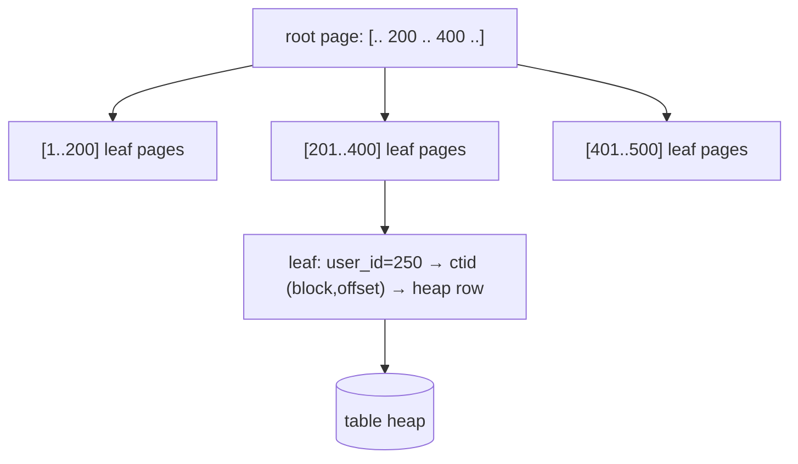

{/* status: authored */}

export const schema = `CREATE TABLE events (
  id       bigint PRIMARY KEY,
  user_id  int    NOT NULL,
  kind     text   NOT NULL,
  created_at timestamptz NOT NULL
);
INSERT INTO events (id, user_id, kind, created_at)
SELECT g,
       (g % 500) + 1,
       (ARRAY['click','view','purchase','signup'])[1 + (g % 4)],
       TIMESTAMPTZ '2024-01-01' + (g || ' minutes')::interval
FROM generate_series(1, 40000) AS g;
ANALYZE events;`;

# Indexes from first principles: the B-tree

## First principles

Without an index, `WHERE user_id = 42` means **read every row** and test it —
a *sequential scan*, O(n). An index is a **separate, sorted data structure** that
maps column values to row locations, so the engine can *seek* instead of scan.

Postgres's default index is a **B-tree** (balanced tree): a shallow tree of
sorted key pages. Finding a key is O(log n) — for 40 000 rows, ~3 page reads
instead of 40 000. A range (`created_at BETWEEN ...`) is "seek to the start, then
walk the leaf level in order".

An index helps only when the query is **selective** — returns a small fraction of
the table. `WHERE kind = 'click'` on data that's 25% clicks: the planner
correctly ignores the index and scans, because jumping to 10 000 scattered rows
costs more than reading the table straight through.

Cost of an index: every `INSERT`/`UPDATE`/`DELETE` must also update it, and it
takes disk. Index the columns you filter/join/sort on **and** that are
selective — not every column.

## The mechanism

Seek `user_id = 250`: root → middle child → leaf page → row pointer(s) → fetch
from the table. 3–4 reads total.

## Hand-trace on dummy data

`WHERE user_id = 250` — scan vs B-tree seek:

<QueryTrace
  caption="sequential scan checks all 40k rows; the index seeks straight to the ~80 matching rows"
  steps={[
    {
      title: "1 · events — 40,000 rows, user_id 1..500 (~80 rows each)",
      op: "user_id",
      table: {
        name: "events (sample)",
        columns: ["id", "user_id", "kind"],
        rows: [[1,1,"view"],[2,2,"purchase"],["…","…","…"],[500,500,"signup"],[501,1,"click"],["…","…","…"]],
      },
    },
    {
      title: "2a · no index: Seq Scan — read 40,000 rows, keep ~80",
      op: "user_id",
      table: {
        columns: ["strategy", "rows read", "rows returned"],
        rows: [["Seq Scan on events", "40,000", "~80"]],
      },
      rows: { drop: [0] },
    },
    {
      title: "3 · CREATE INDEX ON events(user_id) — a sorted B-tree of (user_id → row ptr)",
      op: "user_id",
      table: {
        name: "idx_user_id (leaf level, sorted)",
        columns: ["user_id", "row pointers"],
        rows: [[1,"{...}"],[2,"{...}"],["…","…"],[250,"{ptr, ptr, ... 80 ptrs}"],["…","…"],[500,"{...}"]],
      },
      rows: { match: [3] },
    },
    {
      title: "4 · with index: Index Scan — descend the tree, walk ~80 leaf entries, fetch those rows",
      op: "user_id",
      table: {
        name: "result",
        result: true,
        columns: ["strategy", "index pages read", "table rows fetched"],
        rows: [["Index Scan using idx_user_id", "~3", "~80"]],
      },
    },
  ]}
/>

## Run it

<SqlRunner title="scan → seek: watch the plan change" setup={schema}>
{`EXPLAIN ANALYZE SELECT * FROM events WHERE user_id = 250;
-- Seq Scan, reads all 40k rows

CREATE INDEX idx_events_user ON events (user_id);
ANALYZE events;

EXPLAIN ANALYZE SELECT * FROM events WHERE user_id = 250;
-- now: Index Scan / Bitmap Heap Scan — far fewer rows touched`}
</SqlRunner>

<SqlRunner title="non-selective predicate: planner ignores the index on purpose" setup={schema}>
{`CREATE INDEX idx_events_kind ON events (kind);
ANALYZE events;
EXPLAIN SELECT * FROM events WHERE kind = 'click';   -- ~25% of rows -> still Seq Scan`}
</SqlRunner>

<SqlRunner title="range query on an index" setup={schema}>
{`CREATE INDEX idx_events_created ON events (created_at);
ANALYZE events;
EXPLAIN ANALYZE
SELECT count(*) FROM events
WHERE created_at BETWEEN TIMESTAMPTZ '2024-01-01' AND TIMESTAMPTZ '2024-01-02';`}
</SqlRunner>

<SqlRunner title="composite index column order matters" setup={schema}>
{`CREATE INDEX idx_uk ON events (user_id, kind);
ANALYZE events;
EXPLAIN SELECT * FROM events WHERE user_id = 10 AND kind = 'view';  -- uses idx_uk fully
EXPLAIN SELECT * FROM events WHERE kind = 'view';                    -- can't use idx_uk (skips leading col)`}
</SqlRunner>

<RunThis file="sql/foundations/27_indexes_and_the_b_tree/topic.sql" />

## Build → Break → Fix → Why

:::tip[🔨 Build]
Fast "this user's recent events": `CREATE INDEX ON events (user_id, created_at
DESC)`, then `WHERE user_id = $1 ORDER BY created_at DESC LIMIT 20` is an index
range scan — no sort.
:::

:::danger[💥 Break]
Create `(created_at, user_id)` instead and run `WHERE user_id = $1 ORDER BY
created_at DESC`. The index leads with `created_at`, so a filter on `user_id`
alone can't use it as a starting point — the planner either scans the whole index
or the table.
:::

:::note[🔧 Fix]
Put the **equality** column(s) first, then the **range/sort** column:
`(user_id, created_at DESC)`. Rule: columns used with `=` go left; the one column
used with a range or `ORDER BY` goes last.
:::

:::info[🧠 Why it behaved that way]
A B-tree is sorted by the whole key tuple, left to right — like a phone book
sorted by (last name, first name). You can seek by last name, or last+first, but
not by first name alone. `WHERE user_id = 10` on `(user_id, created_at)` picks a
contiguous slice; `WHERE kind = 'view'` on `(user_id, kind)` would need to check
every `user_id` bucket, so it's no better than a scan.
:::

## Pitfalls & idioms

- Index selective columns you **filter, join, or sort** on. Don't index
  everything — writes pay for every index.
- **Composite index order**: equality columns first, then one range/sort column.
  `(a, b)` also serves `WHERE a = ?` alone (left-prefix); it does **not** serve
  `WHERE b = ?`.
- A predicate on `f(col)` (`lower(email)`, `date(created_at)`) can't use an index
  on `col` — index the expression: `CREATE INDEX ON t (lower(email))`.
- `LIKE 'abc%'` can use a B-tree; `LIKE '%abc'` cannot (needs trigram/GIN).
- After a bulk load, `ANALYZE` so the planner has fresh statistics — otherwise it
  guesses selectivity wrong.
- `EXPLAIN` tells you what the planner *chose*; `EXPLAIN ANALYZE` tells you what
  actually happened — always check the real thing.

## See also

- [Index types & when each wins](/foundations/index-types) — partial, covering, GIN, BRIN
- [Reading query plans](/foundations/reading-query-plans) — Seq Scan vs Index Scan vs Bitmap
- [Query optimization](/foundations/query-optimization) — sargability & statistics
- [Sorting & limiting](/foundations/sorting-and-limiting) — an index that removes the sort

## Check yourself

1. Why is a B-tree lookup O(log n) and a full scan O(n)?
2. Your `WHERE status = 'active'` matches 60% of rows. Will an index on `status`
   help? Why (not)?
3. Index `(user_id, created_at)` — which of these can it serve:
   `WHERE user_id = 1`, `WHERE created_at > x`, `WHERE user_id = 1 AND created_at
   > x`?
4. `WHERE lower(email) = 'a@x.com'` is slow despite an index on `email`. Fix?
5. What must you run after loading a million rows for the planner to make good
   choices?
