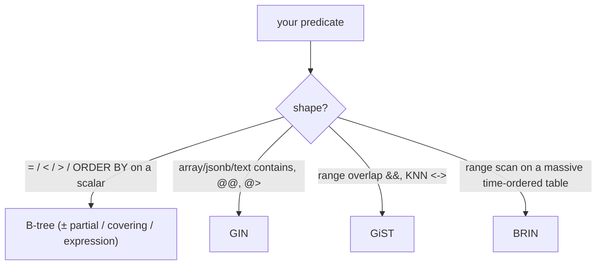

{/* status: authored */}

export const schema = `CREATE TABLE docs (
  id       bigint PRIMARY KEY,
  owner_id int    NOT NULL,
  status   text   NOT NULL,
  tags     text[] NOT NULL DEFAULT '{}',
  body     jsonb  NOT NULL DEFAULT '{}',
  created_at timestamptz NOT NULL,
  deleted_at timestamptz
);
INSERT INTO docs (id, owner_id, status, tags, body, created_at, deleted_at)
SELECT g,
       (g % 200) + 1,
       (ARRAY['draft','published','archived'])[1 + (g % 3)],
       CASE WHEN g % 5 = 0 THEN ARRAY['urgent','sql'] ELSE ARRAY['sql'] END,
       jsonb_build_object('words', g % 1000),
       TIMESTAMPTZ '2024-01-01' + (g || ' minutes')::interval,
       CASE WHEN g % 50 = 0 THEN TIMESTAMPTZ '2024-06-01' END
FROM generate_series(1, 30000) AS g;
ANALYZE docs;`;

# Index types & when each wins

## First principles

The B-tree ([previous topic](/foundations/indexes-and-the-b-tree)) handles
equality and range on scalar, ordered values. Beyond that:

### B-tree variants (still a B-tree, shaped for the query)

| Kind | Definition | Wins when |
|---|---|---|
| **Multicolumn** | `(a, b, c)` | filter on `a`, or `a,b`, or `a,b,c` (left prefix); `ORDER BY a, b` |
| **Partial** | `... WHERE deleted_at IS NULL` | most queries only touch a subset; index is smaller & cheaper to maintain |
| **Covering** | `(owner_id) INCLUDE (status, created_at)` | the query's columns are all in the index → **Index Only Scan**, no heap fetch |
| **Expression** | `(lower(email))`, `(date(created_at))` | you filter on a function of the column |
| **Unique** | `UNIQUE (email)` | enforces the constraint *and* speeds lookups |

### Non-B-tree families

| Type | For | Example query |
|---|---|---|
| **GIN** | "contains" over composite values: arrays, `jsonb`, full-text `tsvector` | `tags @> '{urgent}'`, `body @> '{"words":5}'`, `to_tsvector(body) @@ 'sql'` |
| **GiST** | geometric / range overlap, nearest-neighbour, `EXCLUDE` constraints | `tsrange && '[...]'`, `point <-> '(0,0)'` |
| **BRIN** | huge, **naturally-ordered** tables (append-only by time) — stores min/max per block range, tiny | `created_at > x` on a billion-row log |
| **hash** | equality only, no range; rarely worth it over B-tree | `WHERE uuid = $1` |

## The mechanism

## Hand-trace on dummy data

A partial covering index for the hot query "my non-deleted published docs,
newest first":

<QueryTrace
  caption="a partial index excludes deleted rows; INCLUDE lets the query skip the table"
  steps={[
    {
      title: "1 · docs — 30k rows; 2% soft-deleted; status in {draft,published,archived}",
      op: "status",
      table: {
        name: "docs (sample)",
        columns: ["id", "owner_id", "status", "deleted_at"],
        rows: [[1,2,"published",null],[50,1,"draft","2024-06-01"],[3,4,"archived",null],["…","…","…","…"]],
      },
    },
    {
      title: "2 · full B-tree on (owner_id, created_at) — indexes all 30k, incl. deleted & non-published",
      op: "owner_id",
      table: {
        columns: ["index", "entries", "note"],
        rows: [["(owner_id, created_at)", "30,000", "every row, even ones the query never wants"]],
      },
    },
    {
      title: "3 · partial + covering: WHERE deleted_at IS NULL AND status='published', INCLUDE (id)",
      op: "status",
      table: {
        name: "idx_pub (partial, covering)",
        columns: ["index", "entries", "note"],
        rows: [["(owner_id, created_at DESC) INCLUDE (id) WHERE deleted_at IS NULL AND status='published'", "~9,800", "only the rows the query can return; carries id too"]],
      },
      rows: { match: [0] },
    },
    {
      title: "4 · query plan: Index Only Scan — no heap access, no sort — result",
      table: {
        name: "result",
        result: true,
        columns: ["plan node", "heap fetches", "sort"],
        rows: [["Index Only Scan using idx_pub", "0", "none (index is already in order)"]],
      },
    },
  ]}
/>

## Run it

<SqlRunner title="partial index — smaller, and only for the queries that qualify" setup={schema}>
{`CREATE INDEX idx_docs_live ON docs (owner_id, created_at DESC)
  WHERE deleted_at IS NULL AND status = 'published';
ANALYZE docs;

EXPLAIN
SELECT id, created_at FROM docs
WHERE owner_id = 7 AND deleted_at IS NULL AND status = 'published'
ORDER BY created_at DESC LIMIT 20;`}
</SqlRunner>

<SqlRunner title="covering index → Index Only Scan" setup={schema}>
{`CREATE INDEX idx_cov ON docs (owner_id) INCLUDE (status, created_at);
ANALYZE docs;
EXPLAIN
SELECT owner_id, status, created_at FROM docs WHERE owner_id = 7;
-- look for "Index Only Scan"`}
</SqlRunner>

<SqlRunner title="GIN for array / jsonb containment" setup={schema}>
{`CREATE INDEX idx_tags ON docs USING GIN (tags);
CREATE INDEX idx_body ON docs USING GIN (body jsonb_path_ops);
ANALYZE docs;
EXPLAIN SELECT count(*) FROM docs WHERE tags @> ARRAY['urgent'];
EXPLAIN SELECT count(*) FROM docs WHERE body @> '{"words": 5}';`}
</SqlRunner>

<SqlRunner title="expression index" setup={schema}>
{`-- filtering on a function of a column needs an index ON that function
CREATE INDEX idx_words ON docs (((body ->> 'words')::int));
ANALYZE docs;
EXPLAIN SELECT count(*) FROM docs WHERE (body ->> 'words')::int = 5;`}
</SqlRunner>

<SqlRunner title="BRIN for a big time-ordered table (tiny index)" setup={schema}>
{`CREATE INDEX idx_brin ON docs USING BRIN (created_at);
ANALYZE docs;
EXPLAIN SELECT count(*) FROM docs WHERE created_at > TIMESTAMPTZ '2024-01-15';
SELECT pg_size_pretty(pg_relation_size('idx_brin')) AS brin_size;`}
</SqlRunner>

<RunThis file="sql/foundations/28_index_types/topic.sql" />

## Build → Break → Fix → Why

:::tip 🔨 Build
`CREATE INDEX ON docs USING GIN (tags)` → `WHERE tags @> '{urgent}'` is fast.
:::

:::danger 💥 Break
Use a plain B-tree for the array: `CREATE INDEX ON docs (tags)`. Then
`WHERE tags @> '{urgent}'` **can't use it** — a B-tree indexes the array as one
opaque value, good only for `tags = '{urgent,sql}'` (exact match), not
"contains". Query falls back to a Seq Scan.
:::

:::note 🔧 Fix
Match the index type to the operator: containment (`@>`, `?`, `@@`) → **GIN**;
range overlap (`&&`) / KNN (`<->`) → **GiST**; equality/range on a scalar →
**B-tree**.
:::

:::info 🧠 Why it behaved that way
A B-tree keys on the *whole* value in sort order, so it only answers "equals" and
"between" for that value. "Does this array contain `urgent`?" or "does this jsonb
have this key?" needs an index over the *elements/keys*, which is what GIN builds
— an inverted index from each element to the rows containing it.
:::

## Pitfalls & idioms

- **Partial index** for soft-deleted / status-filtered tables — often halves the
  index and speeds writes.
- **Covering** (`INCLUDE`) turns a lookup into an Index Only Scan **only if** the
  table's visibility map is fresh (`VACUUM`); otherwise it still checks the heap.
- One well-ordered composite index often replaces several single-column ones.
- GIN indexes are slower to build and update; `fastupdate` and a good
  `gin_pending_list_limit` matter for write-heavy tables.
- BRIN is almost free in size but only helps when the column is **physically
  correlated** with row order (natural for `created_at` on an append-only table).
- Don't add indexes speculatively. Add them from real slow queries
  ([EXPLAIN](/foundations/reading-query-plans)), then check `pg_stat_user_indexes`
  and drop the ones never used.
- `CREATE INDEX CONCURRENTLY` in production — a plain `CREATE INDEX` locks writes.

## See also

- [Indexes & the B-tree](/foundations/indexes-and-the-b-tree) — the base case
- [Reading query plans](/foundations/reading-query-plans) — Index Only Scan, Bitmap Index Scan
- [Query optimization](/foundations/query-optimization) — when the planner uses which
- [Backend → Reading EXPLAIN plans](/backend/reading-explain-plans-and-query-optimization) — a real before/after

## Check yourself

1. When is a **partial** index the right call?
2. What does `INCLUDE (cols)` buy you, and what has to be true for the benefit to
   show up?
3. Which index type for `WHERE tags @> '{x}'`? For `WHERE tsrange && '[a,b]'`?
   For `WHERE created_at > x` on a 2-billion-row append-only log?
4. Why can't a B-tree on `email` serve `WHERE lower(email) = ...`?
5. You have single-column indexes on `a`, `b`, `c` and always query
   `WHERE a = ? AND b = ? ORDER BY c`. What one index replaces them?
