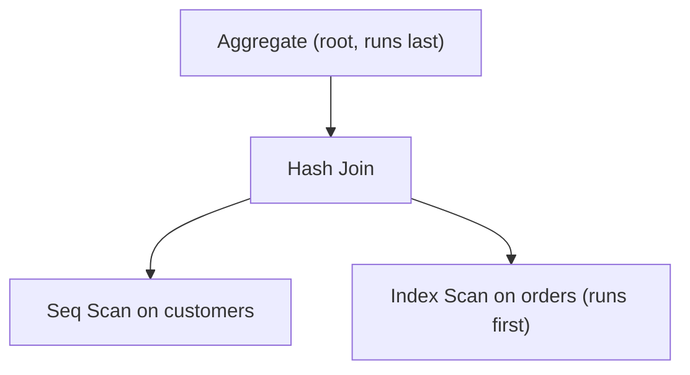

{/* status: authored */}

export const schema = `CREATE TABLE customers (
  customer_id int PRIMARY KEY,
  city text NOT NULL
);
CREATE TABLE orders (
  order_id bigint PRIMARY KEY,
  customer_id int NOT NULL,
  amount numeric NOT NULL,
  created_at timestamptz NOT NULL
);
INSERT INTO customers SELECT g, (ARRAY['Berlin','Lagos','Toronto','Cairo'])[1+(g%4)]
FROM generate_series(1, 2000) g;
INSERT INTO orders
SELECT g, (g % 2000) + 1, (g % 100) + 1,
       TIMESTAMPTZ '2024-01-01' + (g || ' minutes')::interval
FROM generate_series(1, 60000) g;
ANALYZE customers; ANALYZE orders;`;

# Reading query plans: `EXPLAIN` & `EXPLAIN ANALYZE`

## First principles

`EXPLAIN <query>` prints the **plan tree** the planner chose — *estimates*, no
execution. `EXPLAIN (ANALYZE) <query>` **runs** it and adds the *actual* numbers.

Read the tree **inside-out / bottom-up**: the most-indented node runs first, its
parent consumes its rows, and so on to the root.

Each node line looks like:

```
->  Index Scan using orders_pkey on orders  (cost=0.29..8.31 rows=1 width=48)
                                                   (actual time=0.01..0.02 rows=1 loops=1)
```

- **cost=`startup`..`total`** — planner's arbitrary units (roughly page reads).
  Compare, don't interpret absolutely.
- **rows** — *estimated* row count out of this node. In `ANALYZE`, **actual
  rows** appears next to it.
- **width** — estimated bytes per row.
- **actual time=`first`..`all`** — ms to first row / to last row, **per loop**.
- **loops** — how many times this node ran (inner side of a nested loop).
  Multiply `actual time` × `loops` for the real total.

**Node types you'll see constantly:**

| Node | Means | Watch for |
|---|---|---|
| `Seq Scan` | read the whole table | on a big table with a selective filter → missing index |
| `Index Scan` | descend a B-tree, fetch matching heap rows | fine when selective |
| `Index Only Scan` | answered entirely from the index | great; needs a covering index + fresh VACUUM |
| `Bitmap Index Scan` + `Bitmap Heap Scan` | collect row locations, sort, fetch in physical order | medium selectivity |
| `Nested Loop` | for each outer row, probe inner | bad if outer `rows` is large and inner isn't indexed |
| `Hash Join` / `Hash` | build a hash of one side, probe with the other | good for big unsorted joins |
| `Merge Join` | both inputs sorted, zip them | good when inputs are already ordered |
| `Sort` / `Incremental Sort` | ordering rows | a big `Sort` that could be an index |
| `Aggregate` / `HashAggregate` / `GroupAggregate` | `GROUP BY` | |
| `Gather` | parallel workers merging | |

Add `BUFFERS` to see actual page reads: `shared hit` (cache) vs `read` (disk).

## The mechanism



## Hand-trace: reading a real plan

`SELECT c.city, count(*) FROM customers c JOIN orders o USING (customer_id) WHERE
o.amount > 95 GROUP BY c.city`:

<QueryTrace
  caption="bottom-up: scan orders (filtered) → hash-join customers → aggregate by city"
  steps={[
    {
      title: "1 · leaf: Seq Scan on orders, filter amount > 95",
      op: "amount",
      table: {
        columns: ["node", "est rows", "actual rows", "note"],
        rows: [["Seq Scan on orders", "3000", "3000", "amount>95 keeps ~5% of 60k"]],
      },
    },
    {
      title: "2 · leaf: Seq Scan on customers (all 2000 — needed whole for the join)",
      table: {
        columns: ["node", "est rows", "actual rows"],
        rows: [["Seq Scan on customers", "2000", "2000"]],
      },
    },
    {
      title: "3 · Hash Join: build hash on customers.customer_id, probe with orders rows",
      op: "customer_id",
      table: {
        columns: ["node", "est rows", "actual rows"],
        rows: [["Hash Join", "3000", "3000"]],
      },
    },
    {
      title: "4 · HashAggregate: GROUP BY city → 4 rows — the result",
      op: "city",
      table: {
        name: "result",
        result: true,
        columns: ["node", "rows out"],
        rows: [["HashAggregate", "4 (one per city)"]],
      },
    },
  ]}
/>

## Run it

<SqlRunner title="EXPLAIN (plan only)" setup={schema}>
{`EXPLAIN
SELECT c.city, count(*)
FROM customers c JOIN orders o USING (customer_id)
WHERE o.amount > 95
GROUP BY c.city;`}
</SqlRunner>

<SqlRunner title="EXPLAIN (ANALYZE, BUFFERS) — estimated vs actual" setup={schema}>
{`EXPLAIN (ANALYZE, BUFFERS)
SELECT c.city, count(*)
FROM customers c JOIN orders o USING (customer_id)
WHERE o.amount > 95
GROUP BY c.city;`}
</SqlRunner>

<SqlRunner title="a selective query: Seq Scan → Index Scan" setup={schema}>
{`EXPLAIN ANALYZE SELECT * FROM orders WHERE customer_id = 42;   -- Seq Scan (~30 rows out of 60k)
CREATE INDEX ix ON orders (customer_id);
ANALYZE orders;
EXPLAIN ANALYZE SELECT * FROM orders WHERE customer_id = 42;   -- Index Scan`}
</SqlRunner>

<SqlRunner title="misestimate: stale statistics" setup={schema}>
{`-- load a lopsided batch and DON'T analyze
INSERT INTO orders SELECT g, 1, 50, now() FROM generate_series(1000001, 1030000) g;
EXPLAIN ANALYZE SELECT * FROM orders WHERE customer_id = 1;
-- compare "rows=" (estimate) with "actual rows=" — big gap
ANALYZE orders;
EXPLAIN ANALYZE SELECT * FROM orders WHERE customer_id = 1;   -- estimate now close`}
</SqlRunner>

<RunThis file="sql/foundations/29_reading_query_plans/topic.sql" />

## Build → Break → Fix → Why

:::tip[🔨 Build]
`EXPLAIN (ANALYZE, BUFFERS)` your slow query. Find the node where **actual rows ≫
estimated rows**, or where **actual time × loops** dominates. That's your target.
:::

:::danger[💥 Break]
Read `cost` as milliseconds and optimize the number down, or trust `EXPLAIN`
(estimates only) and never run `ANALYZE`. You "improve" a plan whose estimate got
smaller while the real query got slower — the estimate was wrong the whole time.
:::

:::note[🔧 Fix]
- Always `EXPLAIN ANALYZE` (on a realistic copy — it *executes*, including
  writes; wrap DML in `BEGIN; ... ROLLBACK;`).
- Compare `rows` vs `actual rows` at every node. A 100× gap → run `ANALYZE
  <table>`; if it persists, raise the column's statistics target or add
  extended statistics.
- Multiply inner-node `actual time` by `loops`.
:::

:::info[🧠 Why it behaved that way]
`cost` is a unitless blend of estimated page reads and CPU tuples, tuned for
*comparing* candidate plans — it is not time. The planner picks the lowest-cost
plan **given its row estimates**; if those estimates are wrong (stale stats,
correlated columns, a `LIKE '%x%'` it can't estimate), it can pick a
nested-loop that does millions of inner probes. `ANALYZE`'s "actual" numbers are
the ground truth that reveals the bad estimate.
:::

## Pitfalls & idioms

- `EXPLAIN ANALYZE` **runs the query** — including `INSERT`/`UPDATE`/`DELETE`.
  Wrap writes in a transaction you `ROLLBACK`.
- `cost` ≠ time. Use `ANALYZE` timings, and `BUFFERS` for I/O.
- The line to find: biggest `actual rows` misestimate, or biggest `actual time ×
  loops`.
- `rows=1` on a node feeding a `Nested Loop` that turns out to be `rows=100000`
  → the classic "planner chose nested loop, should have hash-joined".
- `Rows Removed by Filter: 900000` under a `Seq Scan` → you want an index on that
  filter column.
- `Sort Method: external merge Disk: 40MB` → `work_mem` too low, or an index
  could remove the sort.
- Use a plan visualiser (pgAdmin's, or explain.dalibo.com) for big plans — paste
  `EXPLAIN (ANALYZE, FORMAT JSON)`.

## See also

- [Query optimization](/foundations/query-optimization) — what to *do* about a bad plan
- [Indexes & the B-tree](/foundations/indexes-and-the-b-tree) — Seq Scan → Index Scan
- [Index types](/foundations/index-types) — Index Only Scan, Bitmap
- [Backend → Reading EXPLAIN plans & query optimization](/backend/reading-explain-plans-and-query-optimization) — an end-to-end walkthrough

## Check yourself

1. In what order do you read the nodes of a plan tree?
2. What does `cost` measure, and what's the one thing it is *not*?
3. A node shows `rows=5` and `actual rows=50000`. What does that tell you and
   what do you try first?
4. What does `loops=2000` next to an inner Index Scan mean for the node's real
   cost?
5. Why must you be careful running `EXPLAIN ANALYZE` on an `UPDATE`?
