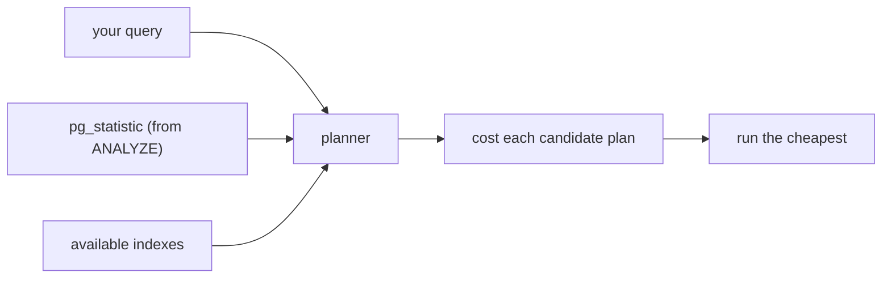

{/* status: authored */}

export const schema = `CREATE TABLE users (
  user_id int PRIMARY KEY,
  email   text NOT NULL,
  created_at timestamptz NOT NULL
);
CREATE TABLE orders (
  order_id bigint PRIMARY KEY,
  user_id  int NOT NULL,
  status   text NOT NULL,
  total    numeric NOT NULL,
  created_at timestamptz NOT NULL
);
INSERT INTO users SELECT g, 'u' || g || '@x.com', TIMESTAMPTZ '2023-01-01' + (g||' minutes')::interval
FROM generate_series(1, 20000) g;
INSERT INTO orders
SELECT g, (g % 20000) + 1,
       (ARRAY['paid','pending','cancelled'])[1+(g%3)],
       (g % 500) + 1,
       TIMESTAMPTZ '2024-01-01' + (g||' minutes')::interval
FROM generate_series(1, 200000) g;
ANALYZE users; ANALYZE orders;`;

# Query optimization: sargability, statistics, join algorithms

## First principles

The planner turns your `SELECT` into candidate plans, estimates each one's cost
from **table statistics**, and runs the cheapest. You make queries fast by:

1. **Writing sargable predicates** — ones an index can satisfy by a range scan.
2. **Keeping statistics accurate** — so the estimates are right.
3. **Giving it useful indexes** — for the filters, joins, and sorts that matter.
4. Occasionally **rewriting** — pre-aggregating, un-nesting, hoisting.

### Sargability

A predicate is **sargable** ("Search ARGument-able") if it's `column <op>
constant` with `op` in `= < <= > >= BETWEEN` and a range-`LIKE`. Non-sargable
forms hide the column inside a function or arithmetic:

| Non-sargable | Sargable rewrite |
|---|---|
| `WHERE date(created_at) = '2024-01-01'` | `WHERE created_at >= '2024-01-01' AND created_at < '2024-01-02'` |
| `WHERE lower(email) = 'a@x.com'` | index on `lower(email)`, keep the predicate |
| `WHERE total * 1.2 > 100` | `WHERE total > 100 / 1.2` |
| `WHERE email LIKE '%acme%'` | trigram/GIN index, or store a normalized column |
| `WHERE user_id::text = '42'` | `WHERE user_id = 42` |

### Join algorithms

| Algorithm | How | Best when |
|---|---|---|
| **Nested Loop** | for each outer row, look up inner (ideally via index) | outer side is small, inner is indexed |
| **Hash Join** | build a hash table on the smaller side, probe with the other | big unsorted inputs, equality join |
| **Merge Join** | sort both sides, walk them together | inputs already sorted (e.g. both from indexes) |

The planner chooses based on estimated row counts. A **bad row estimate** →
"Nested Loop with 1 estimated outer row" that's actually 500 000 → catastrophe.

### Statistics

`ANALYZE` samples each table and stores per-column: null fraction, number of
distinct values, most-common values + frequencies, and a histogram. `autovacuum`
runs `ANALYZE` automatically, but **not instantly** after a big load. Correlated
columns (`city` and `country`) fool the planner unless you add
`CREATE STATISTICS`.

## The mechanism

## Hand-trace: a non-sargable predicate

`WHERE date(created_at) = '2024-02-01'` vs the range rewrite:

<QueryTrace
  caption="wrapping the column in date() blinds the index; a half-open range restores it"
  steps={[
    {
      title: "1 · orders(created_at) has a B-tree index",
      op: "created_at",
      table: {
        name: "idx_created (sorted by created_at)",
        columns: ["created_at", "→ row"],
        rows: [["2024-01-31 23:58","…"],["2024-02-01 00:00","…"],["2024-02-01 12:00","…"],["2024-02-02 00:01","…"]],
      },
    },
    {
      title: "2 · WHERE date(created_at) = '2024-02-01' — index is on created_at, not date(created_at)",
      op: "created_at",
      table: {
        columns: ["plan", "rows read"],
        rows: [["Seq Scan on orders, Filter: date(created_at) = ...", "200,000 (all)"]],
      },
      rows: { drop: [0] },
    },
    {
      title: "3 · WHERE created_at >= '2024-02-01' AND created_at < '2024-02-02' — a contiguous index slice",
      op: "created_at",
      table: {
        columns: ["plan", "rows read"],
        rows: [["Index Scan using idx_created, range [00:00, next day)", "~1,440"]],
      },
      rows: { match: [0] },
    },
    {
      title: "4 · same rows, ~140x less work — result",
      table: {
        name: "result",
        result: true,
        columns: ["approach", "index used?", "rows scanned"],
        rows: [["date() wrapper", "no", "200,000"], ["half-open range", "yes", "~1,440"]],
      },
    },
  ]}
/>

## Run it

<SqlRunner title="sargable vs not" setup={schema}>
{`CREATE INDEX idx_created ON orders (created_at);
ANALYZE orders;

EXPLAIN ANALYZE SELECT count(*) FROM orders
WHERE date(created_at) = DATE '2024-02-01';                 -- Seq Scan

EXPLAIN ANALYZE SELECT count(*) FROM orders
WHERE created_at >= TIMESTAMPTZ '2024-02-01'
  AND created_at <  TIMESTAMPTZ '2024-02-02';               -- Index Scan`}
</SqlRunner>

<SqlRunner title="join algorithm shifts with selectivity" setup={schema}>
{`CREATE INDEX idx_orders_user ON orders (user_id);
ANALYZE orders;
-- selective: one user -> Nested Loop with an index probe
EXPLAIN SELECT u.email, count(*) FROM users u JOIN orders o USING (user_id)
WHERE u.user_id = 7 GROUP BY u.email;
-- broad: all paid orders -> Hash Join
EXPLAIN SELECT u.email, count(*) FROM users u JOIN orders o USING (user_id)
WHERE o.status = 'paid' GROUP BY u.email;`}
</SqlRunner>

<SqlRunner title="the pre-aggregate rewrite (kills fan-out + shrinks the join)" setup={schema}>
{`-- slow shape: join then aggregate over 200k rows
EXPLAIN ANALYZE
SELECT u.email, count(o.*) AS n, sum(o.total) AS spent
FROM users u LEFT JOIN orders o USING (user_id)
GROUP BY u.email;

-- faster: aggregate orders first (20k groups), then join
EXPLAIN ANALYZE
SELECT u.email, coalesce(a.n,0) AS n, coalesce(a.spent,0) AS spent
FROM users u
LEFT JOIN (SELECT user_id, count(*) n, sum(total) spent FROM orders GROUP BY user_id) a
  USING (user_id);`}
</SqlRunner>

<SqlRunner title="extended statistics for correlated columns" setup={schema}>
{`EXPLAIN SELECT count(*) FROM orders WHERE status = 'paid' AND total < 50;
CREATE STATISTICS st_orders (dependencies) ON status, total FROM orders;
ANALYZE orders;
EXPLAIN SELECT count(*) FROM orders WHERE status = 'paid' AND total < 50;`}
</SqlRunner>

<RunThis file="sql/foundations/30_query_optimization/topic.sql" />

## Build → Break → Fix → Why

:::tip[🔨 Build]
"Orders on a given day" as a half-open range on an indexed `created_at`:
`WHERE created_at >= $1::date AND created_at < ($1::date + 1)`.
:::

:::danger[💥 Break]
Write it as `WHERE created_at::date = $1`. On 200 000 rows the index on
`created_at` is unusable; every row gets `::date`-cast and compared — full Seq
Scan, and it gets linearly worse as the table grows.
:::

:::note[🔧 Fix]
Never wrap the indexed column in a function or arithmetic in the predicate. Move
the transform to the **constant** side, or use a **half-open range**, or build an
**expression index** on exactly the transform you need.
:::

:::info[🧠 Why it behaved that way]
A B-tree on `created_at` stores rows ordered by `created_at`. The planner can
turn `created_at >= a AND created_at < b` into "seek to `a`, walk to `b`" because
that maps directly to the index's order. `date(created_at) = d` is a predicate on
a *derived* value the index knows nothing about, so the only way to evaluate it
is to compute `date(...)` for every row — a scan. Same logic for `lower(email)`,
`col + 1`, `col::text`.
:::

## Pitfalls & idioms

- **Keep the indexed column bare** on the left of the operator.
- `ANALYZE` after any bulk load; bump `default_statistics_target` (or per-column)
  for skewed data; `CREATE STATISTICS` for correlated columns.
- **Pre-aggregate before joining** detail tables — turns a huge join + group into
  a small join.
- `OR` across different columns often can't use indexes well → `UNION ALL` of two
  sargable queries, or a composite/covering index.
- `LIMIT` + a matching index = the planner can stop early; `LIMIT` without an
  ordered index still sorts everything.
- Parameter sniffing / generic plans: a prepared statement may cache a plan for
  an atypical parameter. `EXPLAIN` with realistic values.
- Don't add an index per slow query blindly — check `pg_stat_user_indexes`,
  remove unused ones (they tax every write).
- When stuck: `EXPLAIN (ANALYZE, BUFFERS)`, find the misestimated / most
  expensive node, fix *that*.

## See also

- [Reading query plans](/foundations/reading-query-plans) — how to read what you're optimizing
- [Indexes & the B-tree](/foundations/indexes-and-the-b-tree) — selectivity, composite order
- [Index types](/foundations/index-types) — the right structure per predicate
- [Backend → Reading EXPLAIN plans & query optimization](/backend/reading-explain-plans-and-query-optimization) — a full case study

## Check yourself

1. Define "sargable" and give two non-sargable predicates with their fixes.
2. Nested Loop vs Hash Join — when does the planner pick each, and what makes it
   pick wrong?
3. Why does `WHERE created_at::date = '2024-01-01'` defeat an index on
   `created_at`?
4. You bulk-loaded 10M rows and the next query is slow with a terrible estimate.
   First move?
5. A join+`GROUP BY` over a 5M-row detail table is slow. What rewrite usually
   helps and why?
