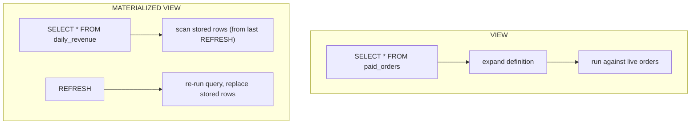

{/* status: authored */}

export const schema = `CREATE TABLE orders (
  order_id bigint PRIMARY KEY,
  customer_id int NOT NULL,
  status   text NOT NULL,
  total    numeric NOT NULL,
  created_at date NOT NULL
);
INSERT INTO orders
SELECT g, (g % 1000) + 1,
       (ARRAY['paid','pending','cancelled'])[1+(g%3)],
       (g % 200) + 1,
       DATE '2024-01-01' + (g % 120)
FROM generate_series(1, 20000) g;
ANALYZE orders;`;

# Views & materialized views

## First principles

**A `VIEW` is a named query.** It stores **no data** — every time you select from
it, the engine substitutes its definition and runs it. It's for **abstraction**:
hide a messy join, expose a stable interface, restrict columns/rows for a role.

```sql
CREATE VIEW paid_orders AS
SELECT order_id, customer_id, total, created_at FROM orders WHERE status = 'paid';

SELECT * FROM paid_orders WHERE created_at >= DATE '2024-03-01';   -- predicate pushed down
```

**A `MATERIALIZED VIEW` is a stored result.** It runs its query **once**, on
`CREATE` and on each `REFRESH`, and keeps the rows on disk like a table (you can
even index it). It's for **expensive aggregations that don't need to be
real-time** — a daily dashboard, a rollup. Its data is **stale** between
refreshes.

```sql
CREATE MATERIALIZED VIEW daily_revenue AS
SELECT created_at AS day, sum(total) AS revenue, count(*) AS orders
FROM orders WHERE status = 'paid' GROUP BY created_at;

REFRESH MATERIALIZED VIEW daily_revenue;                    -- locks reads while rebuilding
REFRESH MATERIALIZED VIEW CONCURRENTLY daily_revenue;       -- no read lock; needs a UNIQUE index
```

| | `VIEW` | `MATERIALIZED VIEW` |
|---|---|---|
| Stores data | no | yes |
| Always current | yes | only as of last `REFRESH` |
| Read cost | = underlying query | = scanning a table (can be indexed) |
| Write to it | sometimes (simple/updatable, or `INSTEAD OF` triggers) | no |
| Good for | abstraction, security, DRY | pre-computed heavy aggregates |

## The mechanism



## Hand-trace on dummy data

`daily_revenue` materialized view: create, then new orders arrive, then refresh:

<QueryTrace
  caption="the matview holds a snapshot; new rows don't appear until REFRESH"
  steps={[
    {
      title: "1 · orders (paid), summed per day at CREATE time",
      op: "created_at",
      table: {
        name: "orders → daily_revenue",
        columns: ["day", "revenue", "orders"],
        rows: [["2024-01-01",120,3],["2024-01-02",95,2],["2024-01-03",210,4]],
      },
    },
    {
      title: "2 · a new paid order lands: (2024-01-02, 40)",
      op: "created_at",
      table: {
        name: "orders (live)",
        columns: ["order_id", "day", "total", "status"],
        rows: [["…","2024-01-02",40,"paid"]],
      },
      rows: { add: [0] },
    },
    {
      title: "3 · SELECT FROM daily_revenue right now — still the old snapshot",
      op: "revenue",
      table: {
        columns: ["day", "revenue", "orders", "note"],
        rows: [["2024-01-02",95,2,"STALE — new order not counted"]],
      },
      rows: { drop: [0] },
    },
    {
      title: "4 · REFRESH MATERIALIZED VIEW daily_revenue — re-run the query — result",
      op: "revenue",
      table: {
        name: "daily_revenue (after REFRESH)",
        result: true,
        columns: ["day", "revenue", "orders"],
        rows: [["2024-01-01",120,3],["2024-01-02",135,3],["2024-01-03",210,4]],
      },
    },
  ]}
/>

## Run it

<SqlRunner title="a plain VIEW — always current, predicates push down" setup={schema}>
{`CREATE VIEW paid_orders AS
SELECT order_id, customer_id, total, created_at FROM orders WHERE status = 'paid';

EXPLAIN SELECT sum(total) FROM paid_orders WHERE created_at >= DATE '2024-04-01';
-- the WHERE from the view AND from your query both apply, in one scan`}
</SqlRunner>

<SqlRunner title="a MATERIALIZED VIEW — fast reads, but stale" setup={schema}>
{`CREATE MATERIALIZED VIEW daily_revenue AS
SELECT created_at AS day, sum(total) AS revenue, count(*) AS orders
FROM orders WHERE status = 'paid' GROUP BY created_at;

CREATE UNIQUE INDEX ON daily_revenue (day);   -- enables REFRESH ... CONCURRENTLY

SELECT * FROM daily_revenue ORDER BY day LIMIT 3;

-- new data arrives:
INSERT INTO orders VALUES (999999, 5, 'paid', 40, DATE '2024-01-02');
SELECT revenue FROM daily_revenue WHERE day = DATE '2024-01-02';   -- unchanged (stale)

REFRESH MATERIALIZED VIEW CONCURRENTLY daily_revenue;
SELECT revenue FROM daily_revenue WHERE day = DATE '2024-01-02';   -- now updated`}
</SqlRunner>

<SqlRunner title="index the matview like a table" setup={schema}>
{`CREATE MATERIALIZED VIEW mv AS
SELECT customer_id, sum(total) AS spent FROM orders WHERE status='paid' GROUP BY customer_id;
CREATE INDEX ON mv (spent DESC);
EXPLAIN SELECT * FROM mv ORDER BY spent DESC LIMIT 10;   -- Index Scan on the matview`}
</SqlRunner>

<RunThis file="sql/foundations/31_views_and_materialized_views/topic.sql" />

## Build → Break → Fix → Why

:::tip[🔨 Build]
A `daily_revenue` **materialized** view refreshed by a nightly job — dashboards
read it instantly.
:::

:::danger[💥 Break]
Point a "current account balance" screen at a materialized view refreshed hourly.
Users see hour-old balances; a deposit "doesn't show up"; support tickets follow.
Or: make it a plain `VIEW` over a 200M-row `transactions` table with a heavy
window function — every page load re-runs the whole aggregation and the dashboard
times out.
:::

:::note[🔧 Fix]
Match the tool to the freshness requirement:

- Needs to be **current** → plain `VIEW` (and make the underlying query fast with
  indexes), or compute on write into a summary table.
- Can tolerate **minutes/hours** of staleness and is **expensive** → materialized
  view + scheduled `REFRESH ... CONCURRENTLY` + an index on it.
- Needs current **and** cheap → maintain a rollup table with triggers or the
  application, or use an incremental-view extension.
:::

:::info[🧠 Why it behaved that way]
A plain view is pure substitution: reading it costs exactly what its query costs,
every time, against live data — always fresh, never cheaper. A materialized view
trades freshness for speed: it's a real stored table whose contents are frozen at
the last `REFRESH`, so reads are a table scan (indexable) but the data is only as
new as that refresh.
:::

## Pitfalls & idioms

- A `VIEW` doesn't make anything faster — it's the same query. Optimize the
  underlying tables.
- Predicates and joins from *your* query combine with the view's; the planner
  flattens simple views entirely.
- `REFRESH MATERIALIZED VIEW` (non-concurrent) takes an `ACCESS EXCLUSIVE` lock —
  reads block. Use `CONCURRENTLY` (needs a `UNIQUE` index; does more work but
  doesn't block).
- Matviews are **not** auto-refreshed. Schedule it (cron, `pg_cron`, your job
  runner).
- Index a materialized view for its read patterns, exactly like a table.
- Updatable views: simple single-table views are updatable; anything with joins/
  aggregates needs `INSTEAD OF` triggers or an updatable-view rule.
- For "always fresh + pre-aggregated", a summary table maintained by trigger or
  by the write path beats a matview.

## See also

- [Common Table Expressions](/foundations/common-table-expressions) — per-statement, not saved
- [Query optimization](/foundations/query-optimization) — making the view's query fast
- [Index types](/foundations/index-types) — indexing a matview
- [Data Engineering → Dimensional modeling](/data-engineering/dimensional-modeling-star-schema) — matviews as pre-aggregated marts

## Check yourself

1. Does a `VIEW` store data? Does a `MATERIALIZED VIEW`?
2. You query a view with an extra `WHERE`. What happens to that predicate?
3. When is a materialized view the wrong choice?
4. What does `REFRESH MATERIALIZED VIEW CONCURRENTLY` need, and what does it buy
   you?
5. "Pre-aggregated *and* always current" — which of these tools gets you there,
   and how?
