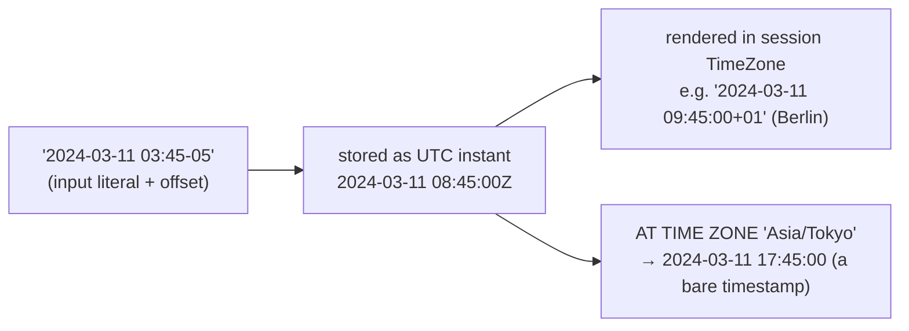

{/* status: authored */}

export const schema = `CREATE TABLE events (
  id      int PRIMARY KEY,
  name    text NOT NULL,
  at      timestamptz NOT NULL     -- an instant in time
);
INSERT INTO events (id, name, at) VALUES
  (1, 'login',   TIMESTAMPTZ '2024-03-10 23:30:00+00'),
  (2, 'view',    TIMESTAMPTZ '2024-03-11 00:15:00+00'),
  (3, 'purchase',TIMESTAMPTZ '2024-03-11 08:45:00+00'),
  (4, 'logout',  TIMESTAMPTZ '2024-03-11 21:05:00+00'),
  (5, 'login',   TIMESTAMPTZ '2024-03-12 06:00:00+00');`;

# Dates, times, intervals & time zones

## First principles

Postgres has several temporal types; pick deliberately:

| Type | Stores | Use for |
|---|---|---|
| `date` | a calendar day, no time | birthdays, "as of" dates |
| `time` | a wall-clock time, no date | opening hours |
| `timestamp` (a.k.a. `timestamp without time zone`) | date + time, **no zone** — just numbers | almost never; a genuine "floating" local time |
| **`timestamptz`** (`timestamp with time zone`) | **an absolute instant** (internally UTC) | events, `created_at`, anything that happened |
| `interval` | a *duration* (`3 days`, `2 hours`) | arithmetic, windows |

**The key misconception**: `timestamptz` does **not** store a time zone. It stores
an instant. On input, the literal's offset (or your session `TimeZone`) converts
it to UTC; on output, it's rendered back into your session zone. `'2024-03-11
08:45:00+00'` and `'2024-03-11 03:45:00-05'` are the **same value**.

**`AT TIME ZONE`** is a conversion operator with two directions:

- `timestamptz AT TIME ZONE 'Europe/Berlin'` → a `timestamp` (the wall-clock
  reading in Berlin at that instant).
- `timestamp AT TIME ZONE 'Europe/Berlin'` → a `timestamptz` (interpret these
  local numbers as Berlin time, give me the instant).

**`date_trunc('day', at)`** truncates *in the session zone* — "the day this
happened" depends on where you are. Truncate `at AT TIME ZONE 'Europe/Berlin'`
for a Berlin-day rollup.

**Ranges**: always **half-open** `[start, end)` for time — `>= start AND < end`.
`BETWEEN` is inclusive on both ends and double-counts boundaries.

## The mechanism

## Hand-trace on dummy data

"Events per **Berlin** calendar day" — truncation in UTC vs Berlin gives
different days for the late-night events:

<QueryTrace
  caption="date_trunc in UTC vs AT TIME ZONE 'Europe/Berlin' — event 1 (23:30 UTC) is already March 11 in Berlin"
  steps={[
    {
      title: "1 · events (at = UTC instants)",
      op: "at",
      table: {
        name: "events",
        columns: ["id", "name", "at (UTC)"],
        rows: [
          [1,"login","2024-03-10 23:30"],
          [2,"view","2024-03-11 00:15"],
          [3,"purchase","2024-03-11 08:45"],
          [4,"logout","2024-03-11 21:05"],
          [5,"login","2024-03-12 06:00"],
        ],
      },
    },
    {
      title: "2 · at AT TIME ZONE 'Europe/Berlin' (UTC+1 in March) — wall clock in Berlin",
      op: "at",
      table: {
        columns: ["id", "at (UTC)", "Berlin local"],
        rows: [
          [1,"2024-03-10 23:30","2024-03-11 00:30"],
          [2,"2024-03-11 00:15","2024-03-11 01:15"],
          [3,"2024-03-11 08:45","2024-03-11 09:45"],
          [4,"2024-03-11 21:05","2024-03-11 22:05"],
          [5,"2024-03-12 06:00","2024-03-12 07:00"],
        ],
      },
    },
    {
      title: "3 · date_trunc('day', ...) on the Berlin wall clock, then GROUP BY",
      op: "at",
      table: {
        columns: ["berlin_day", "events"],
        rows: [["2024-03-11", 4], ["2024-03-12", 1]],
      },
      groups: [
        { label: "2024-03-11", rows: [0] },
        { label: "2024-03-12", rows: [1] },
      ],
    },
    {
      title: "4 · vs truncating in UTC — event 1 lands on March 10 — result",
      table: {
        name: "result",
        result: true,
        columns: ["day", "count (Berlin)", "count (UTC)"],
        rows: [["2024-03-10","0","1"],["2024-03-11","4","3"],["2024-03-12","1","1"]],
      },
    },
  ]}
/>

## Run it

<SqlRunner title="the trace: Berlin-day vs UTC-day" setup={schema}>
{`SELECT
  date_trunc('day', at AT TIME ZONE 'Europe/Berlin')::date AS berlin_day,
  date_trunc('day', at)::date                              AS utc_day,
  count(*)
FROM events
GROUP BY 1, 2
ORDER BY 1;`}
</SqlRunner>

<SqlRunner title="the same instant, three ways to write it" setup={schema}>
{`SELECT
  TIMESTAMPTZ '2024-03-11 08:45:00+00' = TIMESTAMPTZ '2024-03-11 03:45:00-05' AS same,
  TIMESTAMPTZ '2024-03-11 08:45:00+00' AT TIME ZONE 'Asia/Tokyo'  AS tokyo_wall,
  TIMESTAMPTZ '2024-03-11 08:45:00+00' AT TIME ZONE 'UTC'         AS utc_wall;`}
</SqlRunner>

<SqlRunner title="interval arithmetic + half-open ranges" setup={schema}>
{`SELECT name, at,
       at + INTERVAL '90 minutes'          AS plus_90m,
       age(TIMESTAMPTZ '2024-04-01', at)   AS how_long_ago
FROM events
WHERE at >= TIMESTAMPTZ '2024-03-11 00:00+00'
  AND at <  TIMESTAMPTZ '2024-03-12 00:00+00'   -- half-open: the whole of Mar 11 UTC
ORDER BY at;`}
</SqlRunner>

<SqlRunner title="generate a day series and left-join (gap filling)" setup={schema}>
{`SELECT d::date AS day, count(e.id) AS events
FROM generate_series(DATE '2024-03-10', DATE '2024-03-12', INTERVAL '1 day') g(d)
LEFT JOIN events e
  ON e.at >= d AND e.at < d + INTERVAL '1 day'
GROUP BY d
ORDER BY d;`}
</SqlRunner>

<RunThis file="sql/foundations/32_dates_times_and_time_zones/topic.sql" />

## Build → Break → Fix → Why

:::tip[🔨 Build]
"Orders per day in the user's zone": `date_trunc('day', ordered_at AT TIME ZONE
$user_tz)` then `GROUP BY 1`.
:::

:::danger[💥 Break]
Store `ordered_at` as `timestamp` (no zone) and filter `WHERE ordered_at::date =
'2024-03-11'`. Two problems compound: the column has no zone so "which day" is
ambiguous across your users, and `::date` on the column
[defeats the index](/foundations/query-optimization). A report run from a
different server session shows different totals.
:::

:::note[🔧 Fix]
- Column type `timestamptz`. Always.
- Convert to the *reporting* zone explicitly with `AT TIME ZONE`, then truncate.
- Filter with a **half-open `timestamptz` range**, not `::date` or `BETWEEN`:
  `at >= $1 AND at < $2`.
:::

:::info[🧠 Why it behaved that way]
`timestamp` (no tz) is just six numbers with no anchor to a real instant, so
"the same day" is undefined until someone picks a zone — and different sessions
pick differently. `timestamptz` is an absolute instant; `AT TIME ZONE` is the
one explicit place you choose the calendar to bucket it by, and a half-open
range on the raw column stays sargable and never double-counts midnight.
:::

## Pitfalls & idioms

- **`timestamptz` for events, `date` for dates.** Never `timestamp` unless you
  truly mean a floating local time, never `text`.
- `AT TIME ZONE` flips type: `timestamptz → timestamp` and `timestamp →
  timestamptz`. Read it as "give me the reading in / interpret as".
- `date_trunc` and `EXTRACT(dow ...)` use the **session** `TimeZone` — set it, or
  convert first.
- DST: a Berlin day is 23 or 25 hours twice a year. `+ INTERVAL '1 day'` on a
  `timestamptz` respects DST; `+ INTERVAL '24 hours'` does not — pick on purpose.
- `age(a, b)` gives a human interval (years/months/days); `a - b` gives an exact
  interval (days/hours). Don't mix them up in reports.
- `BETWEEN` for time ranges double-counts the endpoint. Use `>= AND <`.
- `now()` / `CURRENT_TIMESTAMP` are `timestamptz` and are fixed for the whole
  transaction; `clock_timestamp()` actually ticks.
- Store the user's zone as an IANA name (`'Europe/Berlin'`), not an offset —
  offsets don't survive DST.

## See also

- [Query optimization](/foundations/query-optimization) — half-open ranges & sargability
- [Window frames](/foundations/window-frames) — `RANGE INTERVAL` frames over time
- [Data types, NULL & three-valued logic](/foundations/data-types-null-and-three-valued-logic) — picking the right type
- [Data Engineering → the date dimension](/data-engineering/) — precomputing calendars

## Check yourself

1. Does `timestamptz` store a time zone? What does it store?
2. `ts AT TIME ZONE 'Asia/Tokyo'` — what type comes out, and what does it mean?
3. Why can `WHERE created_at::date = '2024-03-11'` give different totals to
   different users?
4. Write "count of events on 2024-03-11 in `America/New_York`".
5. `at + INTERVAL '1 day'` vs `at + INTERVAL '24 hours'` across a DST change —
   which is which?
