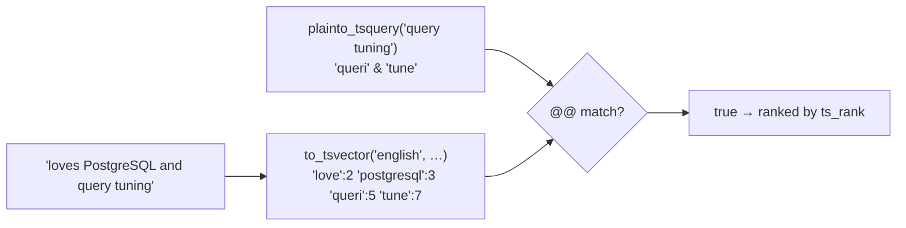

{/* status: authored */}

export const schema = `CREATE TABLE contacts (
  id    int PRIMARY KEY,
  name  text NOT NULL,
  email text NOT NULL,
  bio   text NOT NULL
);
INSERT INTO contacts (id, name, email, bio) VALUES
  (1, 'Ana Ng',       'ana.ng@acme.io',        'Backend engineer, loves PostgreSQL and query tuning.'),
  (2, 'Ben Adeyemi',  'ben@example.com',       'Data engineer. Builds pipelines. Postgres, dbt, Airflow.'),
  (3, 'Chidi Okafor', 'chidi.okafor@acme.io',  'SRE. On-call rotations, incident response, Postgres HA.'),
  (4, 'Dana Prima',  'dana@personal.net',     'Frontend. React, TypeScript. Occasionally writes SQL.'),
  (5, 'Eve Zhou',     'eve.zhou@ACME.io',      'PM for the data platform team.');`;

# Text: pattern matching, regex & full-text basics

## First principles

Four ways to match text, increasing in power and cost:

| Operator | Wildcards | Case | Index? |
|---|---|---|---|
| `LIKE` / `NOT LIKE` | `%` (any run), `_` (one char) | sensitive | B-tree for `'prefix%'` only |
| `ILIKE` | same | **in**sensitive | needs `lower()` index or trigram |
| `SIMILAR TO` | SQL-regex hybrid (`%`, `_`, plus `|`, `*`, `+`, `()`) | sensitive | rarely useful; avoid |
| `~` / `~*` (POSIX regex) | full regex; `~*` is case-insensitive | either | trigram (GIN) index |

Rules that matter:

- `col LIKE 'abc%'` (anchored prefix) can use a plain B-tree index. `col LIKE
  '%abc'` or `'%abc%'` **cannot** — it needs a **trigram** index
  (`pg_trgm` + `GIN`).
- `ILIKE` / `~*` never use a plain B-tree. Index `lower(col)` and compare
  `lower(col) LIKE lower($1)`, or use trigram.
- Escaping: in `LIKE`, a literal `%` or `_` needs `\` (`LIKE '100\%'`).
- `SIMILAR TO` looks like regex but isn't quite; it's a foot-gun. Use `LIKE` for
  simple cases, `~` for real patterns.

**Full-text search** is a different model: `to_tsvector(doc)` turns text into a
sorted list of normalised **lexemes** (stemmed, lowercased, stop-words removed);
`to_tsquery('word')` / `plainto_tsquery('some phrase')` builds a query; `@@`
matches. A `GIN` index on the `tsvector` makes it fast. `ts_rank` orders by
relevance. This is the right tool for "search my `bio` field", not `ILIKE
'%...%'`.

## The mechanism



## Hand-trace on dummy data

Find contacts whose `bio` mentions "postgres" — `ILIKE` vs full-text (note
`PostgreSQL`, `Postgres`, `postgres` all differ in case, and FTS also stems):

<QueryTrace
  caption="ILIKE '%postgres%' misses nothing here by luck; to_tsvector normalises 'PostgreSQL'→'postgresql', matches the lexeme"
  steps={[
    {
      title: "1 · contacts.bio",
      op: "bio",
      table: {
        name: "contacts",
        columns: ["id", "name", "bio (excerpt)"],
        rows: [
          [1,"Ana","… loves PostgreSQL and query tuning."],
          [2,"Ben","… Postgres, dbt, Airflow."],
          [3,"Chidi","… incident response, Postgres HA."],
          [4,"Dana","… React, TypeScript. writes SQL."],
          [5,"Eve","PM for the data platform team."],
        ],
      },
    },
    {
      title: "2 · WHERE bio ILIKE '%postgres%' — case-insensitive substring",
      op: "bio",
      table: {
        columns: ["id", "name", "match?"],
        rows: [[1,"Ana","yes (PostgreSQL)"],[2,"Ben","yes (Postgres)"],[3,"Chidi","yes (Postgres)"],[4,"Dana","no"],[5,"Eve","no"]],
      },
      rows: { drop: [3, 4] },
    },
    {
      title: "3 · WHERE to_tsvector('english', bio) @@ to_tsquery('postgres') — lexeme match",
      note: "to_tsvector stems & lowercases: 'PostgreSQL' → 'postgresql'. to_tsquery('postgres') → 'postgr'? No — 'postgres' stems to 'postgr', which does NOT match 'postgresql'.",
      op: "bio",
      table: {
        columns: ["id", "name", "@@ postgresql", "@@ postgres"],
        rows: [[1,"Ana","yes","no"],[2,"Ben","yes","yes"],[3,"Chidi","yes","yes"]],
      },
    },
    {
      title: "4 · result — ILIKE for exact-substring, FTS for concept search (mind the stemming)",
      table: {
        name: "result",
        result: true,
        columns: ["approach", "matches", "note"],
        rows: [
          ["bio ILIKE '%postgres%'", "1, 2, 3", "substring, case-insensitive"],
          ["@@ to_tsquery('postgres')", "2, 3", "'postgres' stems differently from 'postgresql'"],
        ],
      },
    },
  ]}
/>

## Run it

<SqlRunner title="LIKE / ILIKE / regex" setup={schema}>
{`SELECT name, email,
  email LIKE '%@acme.io'      AS acme_exact,     -- case-sensitive: misses ACME.io
  email ILIKE '%@acme.io'     AS acme_ci,        -- case-insensitive
  email ~* '@acme\\.io$'       AS acme_regex,     -- anchored regex
  name  ~ '^[A-Z][a-z]+ [A-Z]' AS looks_like_name
FROM contacts
ORDER BY id;`}
</SqlRunner>

<SqlRunner title="anchored prefix uses an index; leading % does not" setup={schema}>
{`CREATE INDEX idx_email ON contacts (email text_pattern_ops);
EXPLAIN SELECT * FROM contacts WHERE email LIKE 'ana%';    -- Index Scan
EXPLAIN SELECT * FROM contacts WHERE email LIKE '%acme%';  -- Seq Scan`}
</SqlRunner>

<SqlRunner title="regex extract & replace" setup={schema}>
{`SELECT
  name,
  regexp_replace(email, '@.*$', '')            AS local_part,
  (regexp_match(email, '@(.+)$'))[1]           AS domain,
  regexp_split_to_array(name, '\\s+')           AS name_parts
FROM contacts
ORDER BY id;`}
</SqlRunner>

<SqlRunner title="full-text search with ranking" setup={schema}>
{`SELECT c.name,
       ts_rank(to_tsvector('english', c.bio), q) AS rank
FROM contacts c, plainto_tsquery('english', 'data pipelines') q
WHERE to_tsvector('english', c.bio) @@ q
ORDER BY rank DESC;`}
</SqlRunner>

<RunThis file="sql/foundations/33_text_pattern_matching_and_regex/topic.sql" />

## Build → Break → Fix → Why

:::tip[🔨 Build]
Case-insensitive email lookup that uses an index:

```sql
CREATE INDEX ON users (lower(email));
SELECT * FROM users WHERE lower(email) = lower($1);
```
:::

:::danger[💥 Break]
Do a "search" feature with `WHERE bio ILIKE '%' || $1 || '%'`. On a big table
it's a full scan every keystroke; it can't stem ("run" won't match "running");
and a `$1` of `%` matches everything. Ranking is impossible.
:::

:::note[🔧 Fix]
- Exact / prefix match on a normalised column → `lower(col)` B-tree.
- "Contains" on a big column → `pg_trgm` + `GIN` (`col GIN (col gin_trgm_ops)`),
  then `ILIKE '%x%'` uses it.
- Real search (stemming, ranking, phrases) → a `tsvector` column (often a
  `GENERATED` one) + `GIN` + `to_tsquery` + `ts_rank`.
:::

:::info[🧠 Why it behaved that way]
A B-tree is sorted left-to-right, so it can seek a **known prefix** but has no way
to jump to rows containing a substring anywhere — that's a scan. A trigram index
breaks every string into 3-char pieces and indexes those, so `%abc%` becomes "has
the trigrams of `abc`". Full-text goes further: it stores *lexemes* (linguistic
roots), so `run`, `runs`, `running` collapse to one indexed token and matching is
by meaning, not characters.
:::

## Pitfalls & idioms

- `LIKE 'x%'` → indexable (with `text_pattern_ops` if your DB isn't in the `C`
  locale). `LIKE '%x'` / `'%x%'` → trigram or scan.
- `ILIKE` and `~*` never use a plain B-tree. Normalise with `lower()` or use
  trigram.
- Don't build search on `ILIKE '%...%'`. Use `tsvector` + `GIN`.
- `SIMILAR TO` is neither `LIKE` nor real regex — avoid it.
- `regexp_replace(s, p, r)` replaces the first match; add `'g'` for global.
- Store a `GENERATED ALWAYS AS (to_tsvector('english', body)) STORED` column so
  the index and query never drift, and `ANALYZE`.
- Escape user input before splicing into `LIKE`: `%`, `_`, and `\`.

## See also

- [Index types](/foundations/index-types) — GIN, trigram
- [Query optimization](/foundations/query-optimization) — sargability of `LIKE`
- [Generated columns, domains & custom types](/foundations/generated-columns-domains-and-types) — a stored `tsvector`
- [JSON & JSONB](/foundations/json-and-jsonb) — GIN for a different "contains"

## Check yourself

1. Which of `LIKE 'abc%'`, `LIKE '%abc'`, `ILIKE 'abc%'` can use a plain B-tree
   index?
2. Why is a search feature built on `ILIKE '%term%'` a bad idea on a large table?
3. What does `to_tsvector` do to the word "running"?
4. `email ~* '@acme\.io$'` — what do the `~*`, `\.`, and `$` each contribute?
5. You need fast case-insensitive exact match on `email`. Index and query?
