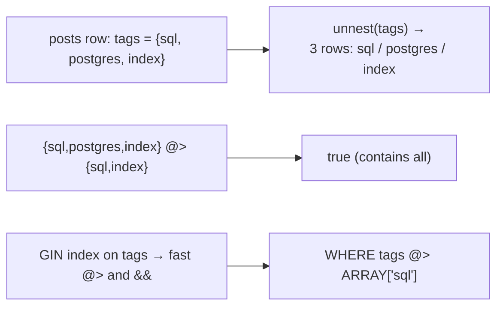

{/* status: authored */}

export const schema = `CREATE TABLE posts (
  id     int PRIMARY KEY,
  title  text NOT NULL,
  tags   text[] NOT NULL DEFAULT '{}'
);
INSERT INTO posts (id, title, tags) VALUES
  (1, 'Indexing basics',   ARRAY['sql','postgres','index']),
  (2, 'Window functions',  ARRAY['sql','postgres']),
  (3, 'Kafka intro',       ARRAY['kafka','streaming']),
  (4, 'Untagged draft',    '{}');`;

# Arrays

## First principles

A column can be an **array** of any type: `int[]`, `text[]`, `timestamptz[]`,
even `jsonb[]`. Useful for a genuinely ordered, homogeneous, small list that
*belongs to* one row and that you rarely join on — tags, a set of role names, a
week's daily totals.

Facts about Postgres arrays:

- **1-based indexing.** `a[1]` is the first element. `a[2:3]` is a slice.
- Out-of-bounds read → `NULL`, not an error.
- Literals: `ARRAY['a','b']` or `'{a,b}'::text[]`. Empty is `'{}'`.
- `array_length(a, 1)` — length along dimension 1 (`cardinality(a)` is total).

**Operators:**

| Op | Means |
|---|---|
| `a @> b` | `a` contains all of `b` |
| `a <@ b` | `a` is contained by `b` |
| `a && b` | `a` and `b` **overlap** |
| `x = ANY(a)` | `x` is an element of `a` (this is what `IN` desugars to) |
| `a || b`, `a || x` | concatenate |

**`unnest(a)`** turns an array into rows (a set-returning function — use it in
`FROM`); **`array_agg(x)`** does the reverse, collapsing a column into an array
(optionally `ORDER BY`).

**When NOT to use an array**: if you filter/join/aggregate on the elements a lot,
or need per-element attributes or foreign keys, use a **junction table**
(`post_tags(post_id, tag)`). An array with a `GIN` index handles "posts tagged
X"; a junction table handles "tags with a description, a count, an FK to a
`tags` table".

## The mechanism

## Hand-trace on dummy data

"Posts tagged both `sql` and `postgres`" via `@>`, and "tag → count" via
`unnest` + `GROUP BY`:

<QueryTrace
  caption="containment filters rows; unnest explodes the array so you can GROUP BY tag"
  steps={[
    {
      title: "1 · posts.tags",
      op: "tags",
      table: {
        name: "posts",
        columns: ["id", "title", "tags"],
        rows: [
          [1,"Indexing basics","{sql, postgres, index}"],
          [2,"Window functions","{sql, postgres}"],
          [3,"Kafka intro","{kafka, streaming}"],
          [4,"Untagged draft","{}"],
        ],
      },
    },
    {
      title: "2 · WHERE tags @> ARRAY['sql','postgres'] — contains both",
      op: "tags",
      table: {
        columns: ["id", "title", "@> {sql,postgres}?"],
        rows: [[1,"Indexing basics","yes"],[2,"Window functions","yes"],[3,"Kafka intro","no"],[4,"Untagged draft","no"]],
      },
      rows: { drop: [2, 3] },
    },
    {
      title: "3 · SELECT unnest(tags) FROM posts — one row per (post, tag)",
      op: "tags",
      table: {
        columns: ["post_id", "tag"],
        rows: [[1,"sql"],[1,"postgres"],[1,"index"],[2,"sql"],[2,"postgres"],[3,"kafka"],[3,"streaming"]],
      },
    },
    {
      title: "4 · GROUP BY tag — the tag histogram — result",
      op: "tag",
      table: {
        name: "result",
        result: true,
        columns: ["tag", "posts"],
        rows: [["postgres",2],["sql",2],["index",1],["kafka",1],["streaming",1]],
      },
    },
  ]}
/>

## Run it

<SqlRunner title="indexing, slicing, ANY" setup={schema}>
{`SELECT title,
  tags[1]                 AS first_tag,
  tags[2:3]               AS middle,
  array_length(tags, 1)   AS n_tags,
  'sql' = ANY(tags)       AS is_sql,
  tags || 'featured'      AS plus_one
FROM posts ORDER BY id;`}
</SqlRunner>

<SqlRunner title="containment & overlap (GIN-indexable)" setup={schema}>
{`CREATE INDEX idx_tags ON posts USING GIN (tags);
SELECT title FROM posts WHERE tags @> ARRAY['sql','postgres'];     -- both
SELECT title FROM posts WHERE tags && ARRAY['kafka','sql'];        -- either
EXPLAIN SELECT title FROM posts WHERE tags @> ARRAY['postgres'];`}
</SqlRunner>

<SqlRunner title="unnest ↔ array_agg" setup={schema}>
{`-- explode
SELECT p.id, tag FROM posts p, unnest(p.tags) AS tag WHERE p.id <= 2 ORDER BY p.id, tag;

-- tag histogram
SELECT tag, count(*) AS posts
FROM posts, unnest(tags) AS tag
GROUP BY tag ORDER BY posts DESC, tag;

-- collapse back, ordered & deduped
SELECT array_agg(DISTINCT tag ORDER BY tag) AS all_tags
FROM posts, unnest(tags) AS tag;`}
</SqlRunner>

<SqlRunner title="array vs junction table — the same question both ways" setup={schema}>
{`-- with the array + GIN
SELECT title FROM posts WHERE tags @> ARRAY['sql'];

-- normalised equivalent
CREATE TABLE post_tags AS SELECT id AS post_id, unnest(tags) AS tag FROM posts;
SELECT p.title FROM posts p JOIN post_tags pt ON pt.post_id = p.id WHERE pt.tag = 'sql';`}
</SqlRunner>

<RunThis file="sql/foundations/35_arrays/topic.sql" />

## Build → Break → Fix → Why

:::tip[🔨 Build]
`tags text[]` + `CREATE INDEX ON posts USING GIN (tags)` → `WHERE tags @>
ARRAY['sql']` is a fast index lookup, and the tag list stays with the row.
:::

:::danger[💥 Break]
Model many-to-many purely as an array and then need: a `tags` table with
descriptions, "rename tag X → Y everywhere", "tags used by ≥ 100 posts with their
creation date", or an FK so you can't tag with a nonexistent tag. Every one of
those is awkward-to-impossible on an array; you end up scanning + `unnest`ing
constantly.
:::

:::note[🔧 Fix]
- Array + `GIN` when the elements are simple values, the list is small, and the
  main query is "rows containing X".
- **Junction table** (`post_tags(post_id, tag_id)`, FKs both ways) the moment you
  need per-element data, referential integrity, or heavy element-level
  aggregation. See [modeling relationships](/backend/).
:::

:::info[🧠 Why it behaved that way]
An array is stored as one opaque value on the row. A `GIN` index over it builds
an inverted map `element → rows`, so "which rows contain `sql`" is a direct
lookup — but the array itself has no identity you can join to, no place for
attributes, and no FK target. A junction row *is* a first-class tuple: it can be
constrained, joined, counted, and given columns.
:::

## Pitfalls & idioms

- **1-based.** `a[0]` is `NULL`, not the first element.
- `x = ANY(a)` is the array form of `IN`. `x <> ALL(a)` is `NOT IN` (same
  [NULL caveat](/foundations/semi-joins-and-anti-joins)).
- `array_length(a, 1)` is `NULL` for an empty array — use
  `coalesce(cardinality(a), 0)`.
- `GIN (a)` accelerates `@>`, `<@`, `&&`, `= ANY`. It does not help ordering or
  `a[1] = x`.
- `unnest` in `FROM` is a lateral SRF; multiple `unnest`s in one `SELECT` zip
  together (and error on length mismatch in modern PG) — usually you want
  `unnest(a) WITH ORDINALITY`.
- Updating one element: `a[2] = x` works; adding: `array_append(a, x)` or `a ||
  x`; removing: `array_remove(a, x)`.
- Don't nest deeply or store huge arrays — that's a [jsonb](/foundations/json-and-jsonb)
  or a table.

## See also

- [LATERAL joins & set-returning functions](/foundations/lateral-joins) — `unnest` in `FROM`
- [Index types](/foundations/index-types) — GIN for arrays
- [Semi-joins & anti-joins](/foundations/semi-joins-and-anti-joins) — `= ANY` / `<> ALL`
- [Aggregation & GROUP BY](/foundations/group-by-and-aggregation) — `array_agg`, `string_agg`
- [Backend → modeling relationships](/backend/) — junction tables

## Check yourself

1. What does `tags[0]` return, and why?
2. `tags @> ARRAY['a','b']` vs `tags && ARRAY['a','b']` — the difference.
3. Rewrite `x IN (1,2,3)` using an array.
4. Write "tag → number of posts" from a `text[]` column.
5. Name three things a junction table gives you that a `tags text[]` column
   can't.
