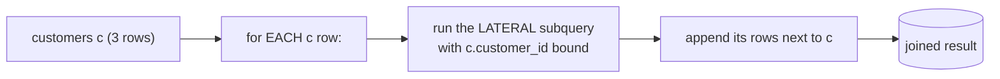

{/* status: authored */}

export const schema = `CREATE TABLE customers (customer_id int PRIMARY KEY, name text NOT NULL);
CREATE TABLE orders (
  order_id int PRIMARY KEY, customer_id int NOT NULL, amount numeric NOT NULL, ordered_at date NOT NULL
);
INSERT INTO customers VALUES (1,'Ana'), (2,'Ben'), (3,'Chidi');
INSERT INTO orders VALUES
  (100,1,40,DATE '2024-01-05'), (101,1,12,DATE '2024-02-01'), (102,1,90,DATE '2024-03-10'),
  (103,2,15,DATE '2024-01-20'), (104,2,55,DATE '2024-02-15'),
  (105,3,30,DATE '2024-03-01');`;

# `LATERAL` joins & set-returning functions

## First principles

Normally each item in `FROM` is evaluated **independently** — a subquery there
can't see columns from the other tables. **`LATERAL`** removes that wall: a
`LATERAL` subquery (or function) is evaluated **once per row** of the items to
its left, and *can* reference their columns.

```sql
SELECT c.name, o.order_id, o.amount
FROM customers c
CROSS JOIN LATERAL (
  SELECT * FROM orders o
  WHERE o.customer_id = c.customer_id      -- ← references c, only legal with LATERAL
  ORDER BY o.amount DESC
  LIMIT 2
) o;
```

That's **top-2-per-group** — cleaner than a `row_number()` subquery when you also
want per-group `LIMIT`, and it lets the planner stop early with an index.

Use `LEFT JOIN LATERAL (...) ON true` to keep left rows even when the subquery
returns nothing (like a `LEFT JOIN`).

**Set-returning functions (SRFs)** — `unnest`, `generate_series`,
`jsonb_array_elements`, `regexp_split_to_table` — return a *set of rows* and live
in `FROM`. Calling one with a column argument (`unnest(t.tags)`) is *implicitly
lateral*. Prefer the explicit `LATERAL` form and put SRFs in `FROM`, not
`SELECT` (SRFs in the select list have confusing semantics and are deprecated
for multi-SRF cases).

## The mechanism



## Hand-trace on dummy data

Each customer with their **2 largest** orders:

<QueryTrace
  caption="the lateral subquery runs per customer, ordered + limited inside"
  steps={[
    {
      title: "1 · customers (left) and orders",
      table: { name: "customers", columns: ["customer_id", "name"], rows: [[1,"Ana"],[2,"Ben"],[3,"Chidi"]] },
    },
    {
      title: "1b · orders",
      op: "customer_id",
      table: {
        name: "orders",
        columns: ["order_id", "customer_id", "amount"],
        rows: [[100,1,40],[101,1,12],[102,1,90],[103,2,15],[104,2,55],[105,3,30]],
      },
    },
    {
      title: "2 · for customer 1: SELECT ... WHERE customer_id = 1 ORDER BY amount DESC LIMIT 2",
      op: "amount",
      table: {
        columns: ["order_id", "amount", "rank in c=1"],
        rows: [[102,90,1],[100,40,2],[101,12,"—"]],
      },
      rows: { drop: [2] },
    },
    {
      title: "3 · repeat per customer, join beside c — result",
      op: "amount",
      table: {
        name: "result",
        result: true,
        columns: ["name", "order_id", "amount"],
        rows: [["Ana",102,90],["Ana",100,40],["Ben",104,55],["Ben",103,15],["Chidi",105,30]],
      },
    },
  ]}
/>

## Run it

<SqlRunner title="top-2 orders per customer" setup={schema}>
{`SELECT c.name, o.order_id, o.amount
FROM customers c
CROSS JOIN LATERAL (
  SELECT order_id, amount FROM orders
  WHERE customer_id = c.customer_id
  ORDER BY amount DESC
  LIMIT 2
) o
ORDER BY c.name, o.amount DESC;`}
</SqlRunner>

<SqlRunner title="LEFT JOIN LATERAL keeps customers with no match" setup={schema}>
{`SELECT c.name, o.order_id, o.amount
FROM customers c
LEFT JOIN LATERAL (
  SELECT order_id, amount FROM orders
  WHERE customer_id = c.customer_id AND amount > 100      -- nobody qualifies
  ORDER BY amount DESC LIMIT 1
) o ON true
ORDER BY c.name;`}
</SqlRunner>

<SqlRunner title="lateral to compute per-row derived values" setup={schema}>
{`SELECT c.name, s.n_orders, s.total, s.last_order
FROM customers c
CROSS JOIN LATERAL (
  SELECT count(*) AS n_orders, sum(amount) AS total, max(ordered_at) AS last_order
  FROM orders WHERE customer_id = c.customer_id
) s
ORDER BY c.name;`}
</SqlRunner>

<SqlRunner title="set-returning functions in FROM" setup={schema}>
{`-- generate_series per row: a running monthly calendar per customer's active range
SELECT c.name, m::date AS month
FROM customers c
CROSS JOIN LATERAL generate_series(
  DATE '2024-01-01', DATE '2024-03-01', INTERVAL '1 month'
) AS m
WHERE c.customer_id = 1;`}
</SqlRunner>

<RunThis file="sql/foundations/36_lateral_joins/topic.sql" />

## Build → Break → Fix → Why

:::tip[🔨 Build]
"Each user's 3 most recent posts" — `CROSS JOIN LATERAL (SELECT ... WHERE
author_id = u.id ORDER BY created_at DESC LIMIT 3) p`. With an index on
`posts(author_id, created_at DESC)` it's 3 index rows per user.
:::

:::danger[💥 Break]
Write the correlated subquery in `FROM` *without* `LATERAL`:

```sql
FROM users u, (SELECT ... FROM posts WHERE author_id = u.id ...) p
-- ERROR: invalid reference to FROM-clause entry for table "u"
```

Or "solve" top-N with `row_number()` over the *whole* `posts` table and filter
`rn <= 3` — correct, but it ranks every post even though you only want 3 per
user, so no early stop.
:::

:::note[🔧 Fix]
Add `LATERAL` (or `CROSS JOIN LATERAL` / `LEFT JOIN LATERAL ... ON true`). The
subquery may now reference the left tables, and with a matching index the
per-group `LIMIT` lets the scan stop after N rows.
:::

:::info[🧠 Why it behaved that way]
The SQL standard evaluates `FROM` items in isolation so the optimizer can reorder
them freely — which means a plain subquery there has no visibility of its
siblings. `LATERAL` explicitly says "evaluate me per row of what's on my left",
turning it into a correlated, nested-loop-friendly join. That per-row evaluation
is exactly what makes `ORDER BY ... LIMIT N` inside it able to touch only N index
entries per group.
:::

## Pitfalls & idioms

- `LATERAL` before a subquery/function in `FROM` when it must see earlier `FROM`
  columns. Table functions with a column argument are implicitly lateral.
- `CROSS JOIN LATERAL` = "at least the left row's worth"; `LEFT JOIN LATERAL ...
  ON true` = keep left rows even with an empty subquery.
- Top-N-per-group: `LATERAL ... LIMIT n` beats `row_number() <= n` when `n` is
  small and an index supports the order.
- `unnest(a) WITH ORDINALITY AS t(elem, pos)` gives you the element position.
- SRFs belong in `FROM`, not `SELECT`. `SELECT unnest(a), unnest(b)` has
  surprising zip semantics.
- The lateral subquery runs per outer row — keep it index-supported or it's an
  N× scan.

## See also

- [Window functions](/foundations/window-functions-partitioning-and-ranking) — the `row_number()` alternative
- [Correlated subqueries & EXISTS](/foundations/correlated-subqueries-and-exists) — the same per-row idea
- [Arrays](/foundations/arrays) / [JSON & JSONB](/foundations/json-and-jsonb) — `unnest`, `jsonb_array_elements`
- [Self-joins & CROSS JOIN](/foundations/self-joins-and-cross-joins) — `generate_series` grids

## Check yourself

1. What can a `LATERAL` subquery in `FROM` do that a plain one can't?
2. `CROSS JOIN LATERAL` vs `LEFT JOIN LATERAL (...) ON true` — when each?
3. Why can `LATERAL (... ORDER BY x LIMIT 3)` beat `row_number() ... WHERE rn <=
   3`?
4. Is `FROM t, unnest(t.tags)` lateral? Why does it work without the keyword?
5. Write "each customer with their single most recent order (or nulls if none)".
