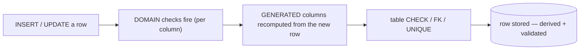

{/* status: authored */}

export const schema = `CREATE TABLE order_lines (
  order_id   int NOT NULL,
  product    text NOT NULL,
  qty        int  NOT NULL CHECK (qty > 0),
  unit_price numeric(10,2) NOT NULL CHECK (unit_price >= 0),
  line_total numeric(12,2) GENERATED ALWAYS AS (qty * unit_price) STORED,
  PRIMARY KEY (order_id, product)
);
INSERT INTO order_lines (order_id, product, qty, unit_price) VALUES
  (100, 'lamp',   1, 28.00),
  (100, 'mug',    2,  9.00),
  (101, 'cable',  3,  8.00);`;

# Generated columns, domains & custom types

## First principles

Three ways to move logic *into the schema* so every writer gets it for free:

### Generated columns

`col type GENERATED ALWAYS AS (expr) STORED` — a column whose value is **computed
from other columns of the same row**, recomputed on every write, and physically
stored (so it's readable and indexable). You cannot write to it directly.

Good for: `line_total = qty * unit_price`, `search tsvector GENERATED ALWAYS AS
(to_tsvector('english', body)) STORED`, `lower_email text GENERATED ALWAYS AS
(lower(email)) STORED` (then index it). The expression must be **immutable** and
reference only this row.

(Postgres 17 has `VIRTUAL` generated columns — computed on read, not stored.
Earlier versions: `STORED` only, or use a view.)

### Domains

A `DOMAIN` is a base type **plus constraints and a default**, reusable as a
column type:

```sql
CREATE DOMAIN email AS text
  CHECK (VALUE ~ '^[^@]+@[^@]+\.[^@]+$');
CREATE DOMAIN positive_int AS int CHECK (VALUE > 0);
```

Now `contact_email email` carries the check everywhere it's used — one
definition, not a copy-pasted `CHECK` on every table.

### Enums & composite types

- `CREATE TYPE order_status AS ENUM ('pending','paid','cancelled')` — a fixed,
  **ordered** set of labels stored compactly (4 bytes). Add values with `ALTER
  TYPE ... ADD VALUE` (can't remove, and adding can't run inside a transaction
  before PG12). A lookup table + FK is the flexible alternative — see
  [enums & lookup tables](/backend/).
- `CREATE TYPE geo AS (lat float, lng float)` — a composite (row) type, usable as
  a column or function return.

## The mechanism



## Hand-trace on dummy data

`line_total` is generated; watch it recompute when `qty` changes:

<QueryTrace
  caption="line_total = qty * unit_price, maintained by the database on every write"
  steps={[
    {
      title: "1 · INSERT (100,'mug',2,9.00) — engine computes line_total",
      op: "line_total",
      table: {
        columns: ["order_id", "product", "qty", "unit_price", "line_total (generated)"],
        rows: [[100,"lamp",1,28.00,28.00],[100,"mug",2,9.00,18.00],[101,"cable",3,8.00,24.00]],
      },
      rows: { add: [1] },
    },
    {
      title: "2 · UPDATE order_lines SET qty = 4 WHERE (100,'mug') — you can't set line_total",
      op: "qty",
      table: {
        columns: ["order_id", "product", "qty", "unit_price", "line_total"],
        rows: [[100,"mug",4,9.00,"→ recomputed"]],
      },
      rows: { match: [0] },
    },
    {
      title: "3 · line_total is now 36.00 automatically — result",
      op: "line_total",
      table: {
        name: "order_lines (after)",
        result: true,
        columns: ["order_id", "product", "qty", "unit_price", "line_total"],
        rows: [[100,"lamp",1,28.00,28.00],[100,"mug",4,9.00,36.00],[101,"cable",3,8.00,24.00]],
      },
    },
  ]}
/>

## Run it

<SqlRunner title="generated column recomputes; can't be written" setup={schema}>
{`SELECT * FROM order_lines ORDER BY order_id, product;

UPDATE order_lines SET qty = 4 WHERE order_id = 100 AND product = 'mug'
RETURNING product, qty, line_total;               -- 36.00, computed for you

-- this fails:
-- UPDATE order_lines SET line_total = 999 WHERE product = 'mug';
--   ERROR: column "line_total" can only be updated to DEFAULT`}
</SqlRunner>

<SqlRunner title="a DOMAIN carries its CHECK everywhere" setup={schema}>
{`CREATE DOMAIN email AS text CHECK (VALUE ~ '^[^@]+@[^@]+\\.[^@]+$');
CREATE TEMP TABLE people (id int, contact email);

INSERT INTO people VALUES (1, 'ana@acme.io');       -- ok
-- INSERT INTO people VALUES (2, 'not-an-email');    -- ERROR: value ... violates check constraint
SELECT * FROM people;`}
</SqlRunner>

<SqlRunner title="an ENUM is ordered and compact" setup={schema}>
{`CREATE TYPE order_status AS ENUM ('pending','paid','cancelled');
CREATE TEMP TABLE o (id int, status order_status NOT NULL);
INSERT INTO o VALUES (1,'paid'), (2,'pending'), (3,'cancelled');

SELECT * FROM o WHERE status < 'cancelled' ORDER BY status;   -- enum order = declaration order
SELECT pg_column_size('paid'::order_status) AS bytes;         -- 4`}
</SqlRunner>

<SqlRunner title="generated tsvector column for search" setup={schema}>
{`CREATE TEMP TABLE docs (
  id int PRIMARY KEY,
  body text NOT NULL,
  search tsvector GENERATED ALWAYS AS (to_tsvector('english', body)) STORED
);
INSERT INTO docs (id, body) VALUES (1, 'PostgreSQL indexing and query tuning');
SELECT id, search FROM docs;
SELECT id FROM docs WHERE search @@ plainto_tsquery('english', 'index tuning');`}
</SqlRunner>

<RunThis file="sql/foundations/37_generated_columns_domains_and_types/topic.sql" />

## Build → Break → Fix → Why

:::tip[🔨 Build]
`line_total numeric GENERATED ALWAYS AS (qty * unit_price) STORED` — invoice
totals can never disagree with their parts.
:::

:::danger[💥 Break]
Keep `line_total` as a plain column the application computes and writes. One code
path forgets to update it after a `qty` change; another writes
`qty * price` before tax while a third writes it after. Now `sum(line_total)` and
`sum(qty * unit_price)` disagree and finance opens a ticket.
:::

:::note[🔧 Fix]
- Derivable from the same row → **generated column** (`STORED`, immutable
  expression). The DB is the single writer.
- Derivable but from *other* rows/tables → a trigger, a view, or a summary table
  ([views & matviews](/foundations/views-and-materialized-views)).
- Reused validation rule → a **domain**, so it's defined once.
:::

:::info[🧠 Why it behaved that way]
A generated column has exactly one writer — the database, on every insert/update
— so there is no code path that can produce an inconsistent value. A domain
attaches the constraint to the *type*, so every column of that type inherits it
without the constraint being restated (and forgotten) per table. Both are the
same principle as [constraints](/foundations/constraints-and-keys): make invalid
states unrepresentable rather than hoping every writer behaves.
:::

## Pitfalls & idioms

- Generated expression must be **`IMMUTABLE`** and reference only the current
  row. `now()`, other tables, subqueries → not allowed (use a trigger).
- You can index a generated column and use it in a `CHECK` or FK.
- `GENERATED ALWAYS AS IDENTITY` is a different feature — auto-incrementing keys,
  not computed-from-columns.
- Enum: `ALTER TYPE ... ADD VALUE` is one-way (no drop, no reorder). If the set
  changes, a lookup table + FK is more flexible.
- Domains can have a `DEFAULT` and `NOT NULL`; a domain `CHECK` runs on cast, so
  even a bare `'x'::email` is validated.
- Composite types are handy for function returns; for storage, separate columns
  usually query better.

## See also

- [Constraints & keys](/foundations/constraints-and-keys) — the broader "make bad states impossible"
- [Triggers & PL/pgSQL basics](/foundations/triggers-and-plpgsql) — derivations a generated column can't do
- [Text: pattern matching & full-text](/foundations/text-pattern-matching-and-regex) — the generated `tsvector`
- [Backend → enums & lookup tables](/backend/) — enum vs lookup-table trade-off

## Check yourself

1. What are the two hard rules on a `GENERATED ALWAYS AS (...) STORED`
   expression?
2. Why can't you `UPDATE ... SET line_total = 5`?
3. When is a trigger required instead of a generated column?
4. What does a `DOMAIN` give you over repeating a `CHECK` on each table?
5. Enum vs lookup table — one advantage of each.
