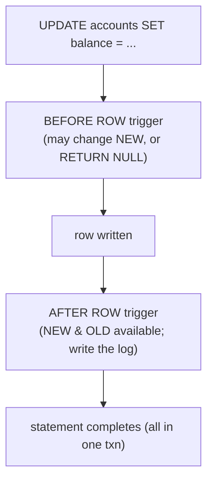

{/* status: authored */}

export const schema = `CREATE TABLE accounts (
  id      int PRIMARY KEY,
  balance numeric NOT NULL DEFAULT 0,
  updated_at timestamptz NOT NULL DEFAULT now()
);
CREATE TABLE account_log (
  id      bigint GENERATED ALWAYS AS IDENTITY PRIMARY KEY,
  account_id int NOT NULL,
  delta   numeric NOT NULL,
  at      timestamptz NOT NULL DEFAULT now()
);
INSERT INTO accounts (id, balance) VALUES (1, 100), (2, 50);`;

# Triggers & PL/pgSQL basics

## First principles

A **trigger** binds a **function** to a table **event** (`INSERT` / `UPDATE` /
`DELETE` / `TRUNCATE`). When the event fires, the function runs — automatically,
for every writer, inside the same transaction.

Two axes:

| | `BEFORE` | `AFTER` |
|---|---|---|
| **`FOR EACH ROW`** | can **modify `NEW`** (the incoming row) or `RETURN NULL` to skip the write | row is already written; use for logging, cascades, notifications |
| **`FOR EACH STATEMENT`** | runs once per statement, no `NEW`/`OLD` row | aggregate audit, refresh a summary |

Inside a `FOR EACH ROW` trigger function you get:

- **`NEW`** — the row being inserted/updated (writable in `BEFORE`).
- **`OLD`** — the row before update/delete.
- `TG_OP` (`'INSERT'`/`'UPDATE'`/`'DELETE'`), `TG_TABLE_NAME`, etc.

**PL/pgSQL** is the procedural language they're written in: `DECLARE` / `BEGIN` /
`END`, `IF`, `LOOP`, `FOR ... IN SELECT`, `RAISE`, `RETURN`. Also used for
functions and `DO` blocks.

**Use triggers sparingly.** They're invisible at the call site — a plain
`UPDATE` silently does five other things. Prefer a
[generated column](/foundations/generated-columns-domains-and-types) or a
[constraint](/foundations/constraints-and-keys) when it fits. Good trigger jobs:
`updated_at` stamping, append-only audit logs, denormalized counters that must
stay exact, enforcing cross-row rules a `CHECK` can't.

## The mechanism

## Hand-trace on dummy data

A `BEFORE UPDATE` trigger stamps `updated_at`; an `AFTER UPDATE` trigger writes
the delta to `account_log`:

<QueryTrace
  caption="one UPDATE fires two triggers: BEFORE rewrites NEW.updated_at, AFTER inserts a log row"
  steps={[
    {
      title: "1 · accounts before; account_log empty",
      table: { name: "accounts", columns: ["id", "balance", "updated_at"], rows: [[1,100,"2024-01-01 00:00"],[2,50,"2024-01-01 00:00"]] },
    },
    {
      title: "2 · UPDATE accounts SET balance = 130 WHERE id = 1",
      op: "balance",
      table: { columns: ["id", "OLD.balance", "NEW.balance"], rows: [[1,100,130]] },
      rows: { match: [0] },
    },
    {
      title: "3 · BEFORE ROW: set NEW.updated_at = now()  (mutates the row being written)",
      op: "updated_at",
      table: { columns: ["id", "NEW.balance", "NEW.updated_at"], rows: [[1,130,"2024-06-01 12:00 (now)"]] },
    },
    {
      title: "4 · AFTER ROW: INSERT INTO account_log (account_id, delta) VALUES (1, NEW.balance - OLD.balance) — result",
      op: "delta",
      table: {
        name: "account_log (result)",
        result: true,
        columns: ["id", "account_id", "delta", "at"],
        rows: [[1, 1, 30, "2024-06-01 12:00"]],
      },
      rows: { add: [0] },
    },
  ]}
/>

## Run it

<SqlRunner title="BEFORE trigger: stamp updated_at" setup={schema}>
{`CREATE FUNCTION touch_updated_at() RETURNS trigger LANGUAGE plpgsql AS $$
BEGIN
  NEW.updated_at := now();
  RETURN NEW;                 -- BEFORE ROW: return the (possibly modified) row
END $$;

CREATE TRIGGER trg_touch
BEFORE UPDATE ON accounts
FOR EACH ROW EXECUTE FUNCTION touch_updated_at();

UPDATE accounts SET balance = balance + 30 WHERE id = 1
RETURNING id, balance, updated_at;`}
</SqlRunner>

<SqlRunner title="AFTER trigger: append-only audit log" setup={schema}>
{`CREATE FUNCTION log_balance_change() RETURNS trigger LANGUAGE plpgsql AS $$
BEGIN
  IF NEW.balance IS DISTINCT FROM OLD.balance THEN
    INSERT INTO account_log (account_id, delta) VALUES (NEW.id, NEW.balance - OLD.balance);
  END IF;
  RETURN NULL;                -- AFTER ROW: return value is ignored
END $$;

CREATE TRIGGER trg_log AFTER UPDATE ON accounts
FOR EACH ROW EXECUTE FUNCTION log_balance_change();

UPDATE accounts SET balance = balance - 10 WHERE id = 1;
UPDATE accounts SET balance = balance + 5  WHERE id = 2;
SELECT * FROM account_log ORDER BY id;`}
</SqlRunner>

<SqlRunner title="BEFORE trigger that rejects a write" setup={schema}>
{`CREATE FUNCTION no_overdraft() RETURNS trigger LANGUAGE plpgsql AS $$
BEGIN
  IF NEW.balance < 0 THEN
    RAISE EXCEPTION 'overdraft on account % (balance %)', NEW.id, NEW.balance;
  END IF;
  RETURN NEW;
END $$;
CREATE TRIGGER trg_guard BEFORE INSERT OR UPDATE ON accounts
FOR EACH ROW EXECUTE FUNCTION no_overdraft();

-- this one raises:
UPDATE accounts SET balance = balance - 999 WHERE id = 1;`}
</SqlRunner>

<SqlRunner title="a plain PL/pgSQL function (no trigger)" setup={schema}>
{`CREATE FUNCTION transfer(p_from int, p_to int, p_amt numeric) RETURNS void
LANGUAGE plpgsql AS $$
BEGIN
  UPDATE accounts SET balance = balance - p_amt WHERE id = p_from;
  UPDATE accounts SET balance = balance + p_amt WHERE id = p_to;
  IF (SELECT balance FROM accounts WHERE id = p_from) < 0 THEN
    RAISE EXCEPTION 'insufficient funds';
  END IF;
END $$;

SELECT transfer(1, 2, 40);
SELECT * FROM accounts ORDER BY id;`}
</SqlRunner>

<RunThis file="sql/foundations/38_triggers_and_plpgsql/topic.sql" />

## Build → Break → Fix → Why

:::tip[🔨 Build]
One `BEFORE UPDATE FOR EACH ROW` trigger per table that does `NEW.updated_at :=
now(); RETURN NEW;` — the timestamp is correct no matter who writes.
:::

:::danger[💥 Break]
Put business logic in a chain of triggers: trigger A updates table B, whose
trigger updates table C, whose trigger writes back to A. A single `INSERT` now
does a dozen hidden writes; a deadlock appears under load; and no one can tell
from the code what an `UPDATE users` actually does. Debugging means reading every
`pg_trigger`.
:::

:::note[🔧 Fix]
- `updated_at`, audit logs, exact counters → a small, obvious trigger.
- Derivation from the same row → a
  [generated column](/foundations/generated-columns-domains-and-types).
- Multi-step business operations → an explicit **function** the app calls
  (`SELECT transfer(...)`), or app code — visible at the call site.
- Never let triggers cascade across tables in a cycle.
:::

:::info[🧠 Why it behaved that way]
A trigger is control flow attached to *data*, not to *code*, so it runs even when
the writer doesn't know it exists — great for invariants, terrible for logic you
need to reason about. `BEFORE ROW` can shape `NEW` because it runs before the
tuple is finalised; `AFTER ROW` sees the committed-within-txn state, so it's the
place for reactions (logs, notifications) but it can't change the row anymore.
:::

## Pitfalls & idioms

- `BEFORE ROW` returns the row to write (`RETURN NEW`), or `RETURN NULL` to
  cancel it. `AFTER ROW` return value is ignored.
- `IF NEW.x IS DISTINCT FROM OLD.x` to act only on real changes (`<>` misses
  NULL transitions).
- `WHEN (condition)` on the `CREATE TRIGGER` skips the function entirely when
  false — cheaper than checking inside.
- Triggers run in the transaction; a `RAISE EXCEPTION` rolls the whole thing
  back.
- Statement-level triggers can use **transition tables** (`REFERENCING NEW TABLE
  AS ...`) to see all affected rows at once — better than N row-trigger calls for
  bulk updates.
- `SECURITY DEFINER` functions run with the owner's rights — powerful and a
  common privilege-escalation footgun; set `search_path` explicitly.
- Keep trigger functions short and side-effect-obvious. Name them for what they
  do.

## See also

- [Generated columns, domains & custom types](/foundations/generated-columns-domains-and-types) — the no-trigger option
- [Constraints & keys](/foundations/constraints-and-keys) — invariants without procedural code
- [Transactions & ACID](/foundations/transactions-and-acid) — triggers run inside the txn
- [Backend → soft deletes & audit columns](/backend/) — audit-log patterns

## Check yourself

1. `BEFORE ROW` vs `AFTER ROW` — which can change the row, and which is for
   logging?
2. What are `NEW` and `OLD`, and when is each populated?
3. Why prefer a generated column over a trigger when both would work?
4. What does `RETURN NULL` do in a `BEFORE ROW INSERT` trigger?
5. Give one legitimate trigger use and one anti-pattern.
