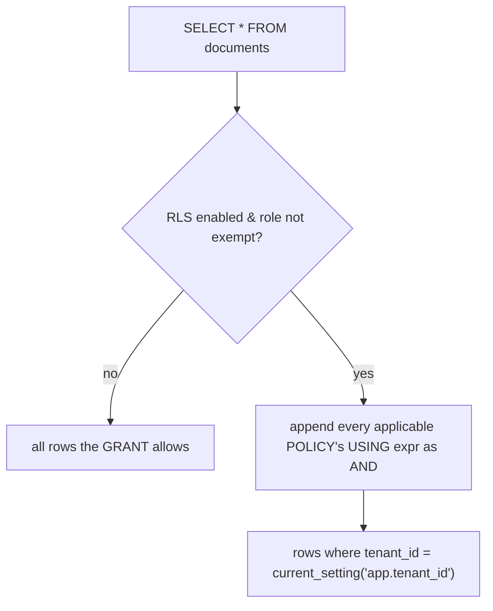

{/* status: authored */}

export const schema = `CREATE TABLE documents (
  id        int PRIMARY KEY,
  tenant_id int NOT NULL,
  title     text NOT NULL,
  body      text NOT NULL
);
INSERT INTO documents VALUES
  (1, 10, 'Acme roadmap',  '...'),
  (2, 10, 'Acme budget',   '...'),
  (3, 20, 'Globex memo',   '...'),
  (4, 20, 'Globex hiring',  '...');`;

# Roles, privileges & row-level security

## First principles

Two layers of access control:

### Roles & `GRANT` — *which objects*

A **role** is a user or a group (Postgres unifies them). Privileges are granted
per object:

```sql
GRANT SELECT, INSERT, UPDATE ON documents TO app_rw;
GRANT SELECT ON documents TO app_ro;
REVOKE DELETE ON documents FROM app_rw;
```

- `GRANT role_a TO role_b` makes `role_b` a *member* of `role_a` (inherits its
  privileges) — that's how you build a group.
- New tables aren't automatically accessible — `ALTER DEFAULT PRIVILEGES` sets
  what future tables grant.
- **Least privilege**: your application connects as a role that can do exactly
  what the app needs and nothing more (no `DROP`, no `SUPERUSER`, often no
  `DELETE`). Migrations use a separate, more privileged role.

### Row-Level Security (RLS) — *which rows*

`GRANT` is all-or-nothing per table. **RLS** filters rows *within* a table based
on the current role / session:

```sql
ALTER TABLE documents ENABLE ROW LEVEL SECURITY;

CREATE POLICY tenant_isolation ON documents
  USING (tenant_id = current_setting('app.tenant_id')::int);
```

Now every query against `documents` — from that role — has
`AND tenant_id = <the session's tenant>` transparently appended. The app sets
`SET app.tenant_id = '10'` per request; a bug that forgets a `WHERE tenant_id =`
can no longer leak another tenant's data.

Policy parts:

- `USING (expr)` — rows visible to `SELECT`/`UPDATE`/`DELETE`.
- `WITH CHECK (expr)` — rows a `INSERT`/`UPDATE` is allowed to *write* (defaults
  to `USING`).
- `FOR {ALL|SELECT|INSERT|UPDATE|DELETE}`, `TO role`.
- Table owners and `BYPASSRLS` roles skip policies — run the app as neither.
- `FORCE ROW LEVEL SECURITY` makes the owner obey them too.

## The mechanism



## Hand-trace on dummy data

Session sets `app.tenant_id = '10'`; the tenant-isolation policy filters:

<QueryTrace
  caption="the policy's USING clause is ANDed onto every query for the non-exempt role"
  steps={[
    {
      title: "1 · documents (4 rows, 2 tenants)",
      op: "tenant_id",
      table: {
        name: "documents",
        columns: ["id", "tenant_id", "title"],
        rows: [[1,10,"Acme roadmap"],[2,10,"Acme budget"],[3,20,"Globex memo"],[4,20,"Globex hiring"]],
      },
    },
    {
      title: "2 · SET app.tenant_id = '10';  then  SELECT * FROM documents",
      op: "tenant_id",
      table: {
        columns: ["id", "tenant_id", "policy: tenant_id = 10?"],
        rows: [[1,10,"yes"],[2,10,"yes"],[3,20,"no"],[4,20,"no"]],
      },
      rows: { drop: [2, 3] },
    },
    {
      title: "3 · even  SELECT * FROM documents WHERE id = 3  returns nothing — result",
      table: {
        name: "result (as tenant 10)",
        result: true,
        columns: ["id", "tenant_id", "title"],
        rows: [[1,10,"Acme roadmap"],[2,10,"Acme budget"]],
      },
    },
  ]}
/>

## Run it

<SqlRunner title="RLS: tenant isolation via a session setting" setup={schema}>
{`ALTER TABLE documents ENABLE ROW LEVEL SECURITY;
ALTER TABLE documents FORCE ROW LEVEL SECURITY;    -- so even the owner obeys it here

CREATE POLICY tenant_isolation ON documents
  USING (tenant_id = current_setting('app.tenant_id', true)::int)
  WITH CHECK (tenant_id = current_setting('app.tenant_id', true)::int);

SET app.tenant_id = '10';
SELECT id, tenant_id, title FROM documents;             -- only tenant 10
SELECT id FROM documents WHERE id = 3;                  -- 0 rows: id 3 is tenant 20

SET app.tenant_id = '20';
SELECT id, tenant_id, title FROM documents;             -- now only tenant 20`}
</SqlRunner>

<SqlRunner title="WITH CHECK blocks writing into another tenant" setup={schema}>
{`ALTER TABLE documents ENABLE ROW LEVEL SECURITY;
ALTER TABLE documents FORCE ROW LEVEL SECURITY;
CREATE POLICY iso ON documents
  USING (tenant_id = current_setting('app.tenant_id', true)::int)
  WITH CHECK (tenant_id = current_setting('app.tenant_id', true)::int);

SET app.tenant_id = '10';
INSERT INTO documents VALUES (5, 10, 'Acme Q3', '...');    -- ok, same tenant
-- INSERT INTO documents VALUES (6, 20, 'sneaky', '...');  -- ERROR: new row violates row-level security policy
SELECT id, tenant_id FROM documents ORDER BY id;`}
</SqlRunner>

<SqlRunner title="GRANT / REVOKE and role membership" setup={schema}>
{`CREATE ROLE app_ro;
CREATE ROLE app_rw;
GRANT SELECT ON documents TO app_ro;
GRANT SELECT, INSERT, UPDATE ON documents TO app_rw;
GRANT app_ro TO app_rw;                                -- app_rw inherits app_ro

SELECT grantee, privilege_type
FROM information_schema.role_table_grants
WHERE table_name = 'documents' AND grantee IN ('app_ro','app_rw')
ORDER BY grantee, privilege_type;`}
</SqlRunner>

<RunThis file="sql/foundations/39_roles_privileges_and_row_level_security/topic.sql" />

:::note[Runner note]
PGlite runs everything as one superuser, so `SET ROLE` and connecting as a
different user aren't fully modelled here. The `topic.sql` (run against a real
PostgreSQL) exercises `SET ROLE` and a non-exempt role properly.
:::

## Build → Break → Fix → Why

:::tip[🔨 Build]
Multi-tenant app: `ENABLE ROW LEVEL SECURITY` + a `tenant_isolation` policy
keyed on `current_setting('app.tenant_id')`, and the connection pool runs `SET
app.tenant_id = $tenant` at the start of each request's transaction.
:::

:::danger[💥 Break]
Rely only on `WHERE tenant_id = $1` in application code. One endpoint — an
admin export, a background job, a new engineer's query — forgets it, and now
Globex sees Acme's budget. There's no safety net; the leak is a code review
someone missed.
:::

:::note[🔧 Fix]
RLS makes the tenant filter a property of the *table*, not of each query. Combine
with least-privilege roles (`GRANT` only what the app needs) so a compromised app
credential also can't `DROP` or read other schemas.
:::

:::info[🧠 Why it behaved that way]
`GRANT` decides whether a role may touch a table at all — it can't express "these
rows yes, those no". RLS pushes a `WHERE` predicate into the planner for every
statement from a non-exempt role, so the restriction can't be forgotten or
bypassed by omission. The table owner and `BYPASSRLS` roles skip it, which is why
the app must not run as either — and `FORCE ROW LEVEL SECURITY` closes the owner
gap.
:::

## Pitfalls & idioms

- **App connects as a least-privilege, non-owner, non-`BYPASSRLS` role.** Owner
  and superuser skip RLS.
- `current_setting('app.x', true)` — the `true` (missing_ok) avoids an error when
  the setting is unset; handle the `NULL` in the policy.
- Set the tenant with `SET LOCAL` (transaction-scoped) in a pooled connection, or
  it leaks to the next request on that connection.
- `USING` filters reads; `WITH CHECK` filters writes. Set both, or an update can
  move a row out of your view.
- Multiple permissive policies are `OR`ed; add a `RESTRICTIVE` policy for `AND`.
- Indexes still apply — add `tenant_id` as the leading column of your composite
  indexes so RLS-filtered queries stay fast.
- `ALTER DEFAULT PRIVILEGES` so future tables don't silently become inaccessible
  (or over-accessible).

## See also

- [Constraints & keys](/foundations/constraints-and-keys) — enforcing rules in the DB
- [Isolation levels & MVCC](/foundations/isolation-levels-and-mvcc) — RLS runs inside the transaction
- [Indexes & the B-tree](/foundations/indexes-and-the-b-tree) — keep `tenant_id` leading
- [Backend → safe migrations](/backend/) — the privileged migration role

## Check yourself

1. `GRANT` controls access to *what*? RLS controls access to *what*?
2. Why must the application role not be the table owner when using RLS?
3. `USING` vs `WITH CHECK` in a policy.
4. What's the risk of `SET app.tenant_id` (without `LOCAL`) on a pooled
   connection?
5. Sketch the two-part setup for tenant isolation on a `documents` table.
