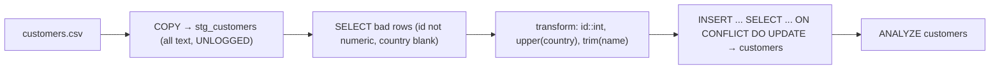

{/* status: authored */}

export const schema = `CREATE TABLE customers (customer_id int PRIMARY KEY, name text NOT NULL, country text NOT NULL);
INSERT INTO customers VALUES (1,'Ana','DE'), (2,'Ben','NG');

-- a raw landing area for an incoming file
CREATE TABLE stg_customers (
  customer_id text,   -- everything text first: bad rows land, don't abort the load
  name        text,
  country     text
);
INSERT INTO stg_customers VALUES
  ('3','Chidi','ng'),
  ('4','Dana',''),          -- missing country
  ('x','Eve','US'),         -- bad id
  ('2','Ben Updated','de'); -- existing customer, new name`;

# Bulk loading: `COPY`, `\copy` & staging tables

## First principles

**`COPY` is the fast path.** `INSERT` parses and plans one statement per row and
round-trips per row; `COPY` streams rows in one command with minimal per-row
overhead — often **10–50× faster** for large loads.

```sql
-- server-side: file must be on the DB server, needs privileges
COPY customers (customer_id, name, country) FROM '/data/customers.csv' WITH (FORMAT csv, HEADER);

-- client-side (psql meta-command): file is on YOUR machine, no server access needed
\copy customers (customer_id, name, country) FROM 'customers.csv' WITH (FORMAT csv, HEADER)

-- export
\copy (SELECT * FROM customers WHERE country = 'DE') TO 'de.csv' WITH (FORMAT csv, HEADER)
```

`COPY` is **all-or-nothing** — one bad row aborts the whole load. So you don't
`COPY` straight into your real table.

**The staging pattern:**

1. `COPY` the raw file into a **staging table** with **loose types** (all `text`)
   — every row lands, including malformed ones.
2. **Validate / profile**: `SELECT` the bad rows out (`WHERE customer_id !~
   '^\d+$'`, `WHERE country = ''`).
3. **Transform** in SQL: cast, trim, uppercase, look up keys.
4. **Load** the clean rows into the real table with `INSERT ... SELECT` (+ `ON
   CONFLICT` for upsert) or [`MERGE`](/foundations/upsert-and-merge).

**Speeding a big load:**

- Load into the table **before** creating its secondary indexes; create them
  after. Maintaining an index per row is slower than one bulk build.
- One big transaction (or a few), not autocommit per row.
- `SET LOCAL synchronous_commit = off` for a load you can re-run on crash.
- `CREATE UNLOGGED TABLE` for staging — no WAL, much faster writes, lost on
  crash (fine for a re-runnable load).
- `ALTER TABLE ... SET (autovacuum_enabled = false)` during the load, `ANALYZE`
  after.

## The mechanism



## Hand-trace on dummy data

Staging → validate → transform → upsert:

<QueryTrace
  caption="raw rows land in staging; the two bad ones are filtered; the rest cast & upsert"
  steps={[
    {
      title: "1 · stg_customers (raw, all text — everything landed)",
      op: "customer_id",
      table: {
        name: "stg_customers",
        columns: ["customer_id", "name", "country"],
        rows: [["3","Chidi","ng"],["4","Dana",""],["x","Eve","US"],["2","Ben Updated","de"]],
      },
    },
    {
      title: "2 · validate: drop rows where id isn't numeric or country is blank",
      op: "customer_id",
      table: {
        columns: ["customer_id", "name", "country", "valid?"],
        rows: [["3","Chidi","ng","ok"],["4","Dana","","✗ blank country"],["x","Eve","US","✗ bad id"],["2","Ben Updated","de","ok"]],
      },
      rows: { drop: [1, 2] },
    },
    {
      title: "3 · transform: customer_id::int, upper(trim(country)), trim(name)",
      op: "country",
      table: {
        columns: ["customer_id", "name", "country"],
        rows: [[3,"Chidi","NG"],[2,"Ben Updated","DE"]],
      },
    },
    {
      title: "4 · INSERT ... ON CONFLICT (customer_id) DO UPDATE → customers — result",
      op: "customer_id",
      table: {
        name: "customers (after)",
        result: true,
        columns: ["customer_id", "name", "country"],
        rows: [[1,"Ana","DE"],[2,"Ben Updated","DE"],[3,"Chidi","NG"]],
      },
      rows: { add: [1, 2] },
    },
  ]}
/>

## Run it

<SqlRunner title="staging → validate → transform → upsert" setup={schema}>
{`-- 1 · which rows are bad?
SELECT * FROM stg_customers
WHERE customer_id !~ '^\\d+$' OR coalesce(trim(country), '') = '';

-- 2 · load only the good rows, transformed
INSERT INTO customers (customer_id, name, country)
SELECT customer_id::int, trim(name), upper(trim(country))
FROM stg_customers
WHERE customer_id ~ '^\\d+$' AND trim(country) <> ''
ON CONFLICT (customer_id) DO UPDATE
  SET name = EXCLUDED.name, country = EXCLUDED.country;

SELECT * FROM customers ORDER BY customer_id;`}
</SqlRunner>

<SqlRunner title="build-then-index is faster than index-then-load" setup={schema}>
{`CREATE UNLOGGED TABLE big (id int, v int);       -- no WAL for a re-runnable load
INSERT INTO big SELECT g, g % 100 FROM generate_series(1, 50000) g;   -- bulk insert, no index yet
CREATE INDEX ON big (v);                          -- one bulk build
ANALYZE big;
EXPLAIN SELECT count(*) FROM big WHERE v = 7;`}
</SqlRunner>

<SqlRunner title="COPY ... TO STDOUT for a quick export shape" setup={schema}>
{`-- what \\copy (...) TO 'file.csv' produces, previewed as rows:
SELECT string_agg(customer_id || ',' || name || ',' || country, E'\\n') AS csv
FROM customers;`}
</SqlRunner>

<RunThis file="sql/foundations/40_bulk_loading_and_copy/topic.sql" />

:::note[Runner note]
`COPY FROM`/`\copy` move data over a client protocol, so they aren't run in the
in-page editor. The `topic.sql` (run with `psql`) uses `COPY ... FROM STDIN`
with inline data — that's the real thing.
:::

## Build → Break → Fix → Why

:::tip[🔨 Build]
`\copy raw FROM 'file.csv'` into an `UNLOGGED` all-`text` staging table → filter
bad rows into a rejects table → `INSERT ... SELECT ... ON CONFLICT` the rest into
the real table → `ANALYZE`.
:::

:::danger[💥 Break]
Load a 5M-row file as 5M single-row `INSERT`s from application code, autocommit
on, into a table with four indexes. It takes hours (per-row parse + plan + WAL
flush + four index updates), and one bad row 3M in leaves you half-loaded with no
clean way to resume.
:::

:::note[🔧 Fix]
- `COPY` / `\copy`, not a loop of `INSERT`s.
- Into a **staging** table so a bad row doesn't abort everything.
- Create secondary indexes **after** the bulk load.
- One transaction (or batched), `ANALYZE` at the end.
:::

:::info[🧠 Why it behaved that way]
Each `INSERT` is a full statement: parse, plan, execute, WAL, index maintenance,
and a network round-trip — fixed costs that dwarf the tuple itself. `COPY`
amortises all of that across the whole stream. Loading before indexing turns "N
index inserts" into "one sorted bulk build". Staging with loose types means the
`COPY` can't be aborted by data you haven't cleaned yet.
:::

## Pitfalls & idioms

- `COPY` = server-side (file on the DB host, needs privileges). `\copy` =
  client-side psql (file on your machine). Same options.
- `COPY` aborts on the first bad row. Stage first, or use a tool that captures
  rejects.
- `WITH (FORMAT csv, HEADER, NULL '', DELIMITER '|')` — set these to match the
  file.
- `UNLOGGED` staging: fast, but truncated on crash — only for re-runnable loads.
- Drop/disable non-essential indexes and `FK`s for a huge initial load; recreate
  and `VALIDATE` after.
- `ANALYZE` after every big load or the planner works from stale stats
  ([query optimization](/foundations/query-optimization)).
- For continuous ingestion, `COPY` in batches into a partition, then attach it —
  see [Data Engineering → partitioning](/data-engineering/).

## See also

- [Upsert & MERGE](/foundations/upsert-and-merge) — the load step
- [Modifying data](/foundations/modifying-data) — `INSERT ... SELECT`
- [Indexes & the B-tree](/foundations/indexes-and-the-b-tree) — why build-then-index
- [Data Engineering → incremental loads](/data-engineering/) — staging in a pipeline

## Check yourself

1. Why is `COPY` so much faster than a loop of `INSERT`s?
2. `COPY` vs `\copy` — where does the file live for each?
3. Why load into a loose-typed staging table instead of straight into the real
   one?
4. Why create secondary indexes after the bulk load rather than before?
5. What must you run after a large load, and why?
