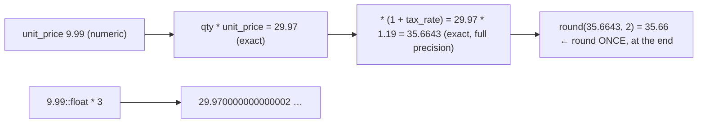

{/* status: authored */}

export const schema = `CREATE TABLE line_items (
  id         int PRIMARY KEY,
  qty        int NOT NULL,
  unit_price numeric(12,2) NOT NULL,   -- exact, 2 decimal places
  tax_rate   numeric(5,4)  NOT NULL    -- e.g. 0.1900
);
INSERT INTO line_items (id, qty, unit_price, tax_rate) VALUES
  (1, 3, 9.99,  0.1900),
  (2, 1, 0.10,  0.0700),
  (3, 7, 2.05,  0.1900);`;

# Numeric precision, money & rounding

## First principles

| Type | Representation | Exact? | Use for |
|---|---|---|---|
| `integer` / `bigint` | binary integer | yes | counts, ids, cents |
| `numeric` / `numeric(p, s)` | **decimal**, arbitrary precision | **yes** | **money**, rates, anything where `0.1 + 0.2` must equal `0.3` |
| `real` / `double precision` | IEEE-754 **binary** float | **no** | measurements, science, ML features — never money |

**Float can't represent `0.1`.** `0.1 + 0.2` is `0.30000000000000004`. Sum a
million float prices and the error compounds. `numeric` stores base-10 digits, so
`0.1 + 0.2 = 0.3` exactly.

**`numeric(p, s)`** = at most `p` significant digits total, `s` of them after the
decimal point. `numeric(12,2)` holds up to `9999999999.99`. Storing a value with
more than `s` fraction digits **rounds** (half-to-even? no — Postgres `numeric`
rounds half **away from zero**). Exceeding `p` is an error.

**Integer division truncates**: `7 / 2 = 3`, not `3.5`. `7 / 2.0 = 3.5`. Cast one
operand: `qty::numeric / n`, or `qty * 1.0`.

**Where to round**: keep full precision through the calculation, round **once**,
at the end, at the point of presentation or storage. `round(x, 2)` for 2 places;
`round(x)` for integer. Rounding intermediate results then summing gives
different totals than summing then rounding ("penny rounding" disputes).

Alternative for money: store **integer cents** (`bigint`), format on the way out.
Immune to every fraction bug; slightly more code.

## The mechanism

## Hand-trace on dummy data

Line total with tax — full precision through, round once:

<QueryTrace
  caption="qty * unit_price * (1 + tax_rate) kept exact; rounded only for the final column"
  steps={[
    {
      title: "1 · line_items",
      op: "unit_price",
      table: {
        name: "line_items",
        columns: ["id", "qty", "unit_price", "tax_rate"],
        rows: [[1,3,9.99,0.1900],[2,1,0.10,0.0700],[3,7,2.05,0.1900]],
      },
    },
    {
      title: "2 · subtotal = qty * unit_price  (exact numeric)",
      op: "unit_price",
      table: {
        columns: ["id", "qty * unit_price"],
        rows: [[1,"29.97"],[2,"0.10"],[3,"14.35"]],
      },
    },
    {
      title: "3 · with_tax = subtotal * (1 + tax_rate)  — keep every digit",
      op: "tax_rate",
      table: {
        columns: ["id", "subtotal * (1 + rate)"],
        rows: [[1,"35.6643"],[2,"0.1070"],[3,"17.0765"]],
      },
    },
    {
      title: "4 · round(with_tax, 2)  ONCE — the result",
      op: "with_tax",
      table: {
        name: "result",
        result: true,
        columns: ["id", "line_total"],
        rows: [[1,"35.66"],[2,"0.11"],[3,"17.08"]],
      },
    },
  ]}
/>

## Run it

<SqlRunner title="numeric is exact, float is not" setup={schema}>
{`SELECT
  0.1::numeric + 0.2::numeric        AS num_sum,      -- 0.3
  0.1::float8  + 0.2::float8         AS float_sum,    -- 0.30000000000000004
  (0.1::float8 + 0.2::float8) = 0.3  AS float_eq_3;   -- false`}
</SqlRunner>

<SqlRunner title="line total: full precision through, round once" setup={schema}>
{`SELECT id,
  qty * unit_price                                AS subtotal,
  qty * unit_price * (1 + tax_rate)               AS with_tax_exact,
  round(qty * unit_price * (1 + tax_rate), 2)     AS line_total
FROM line_items
ORDER BY id;`}
</SqlRunner>

<SqlRunner title="round-then-sum ≠ sum-then-round" setup={schema}>
{`WITH per_line AS (
  SELECT round(qty * unit_price * (1 + tax_rate), 2) AS rounded,
         qty * unit_price * (1 + tax_rate)           AS exact
  FROM line_items
)
SELECT sum(rounded)          AS sum_of_rounded,
       round(sum(exact), 2)  AS round_of_sum
FROM per_line;`}
</SqlRunner>

<SqlRunner title="integer division truncates" setup={schema}>
{`SELECT 7 / 2            AS int_div,       -- 3
       7 / 2.0          AS one_float,     -- 3.5
       7::numeric / 2   AS cast_numeric,  -- 3.5
       7 % 2            AS remainder;     -- 1`}
</SqlRunner>

<SqlRunner title="storing cents as bigint" setup={schema}>
{`CREATE TEMP TABLE payments (id int, amount_cents bigint);
INSERT INTO payments VALUES (1, 999), (2, 10), (3, 2050);
SELECT id,
       amount_cents,
       (amount_cents / 100.0)::numeric(12,2) AS as_dollars
FROM payments;
SELECT sum(amount_cents) AS total_cents FROM payments;   -- exact integer sum`}
</SqlRunner>

<RunThis file="sql/foundations/41_numeric_precision_money_and_rounding/topic.sql" />

## Build → Break → Fix → Why

:::tip[🔨 Build]
`amount numeric(12,2) NOT NULL` (or `bigint` cents). Compute at full precision,
`round(..., 2)` exactly once for the stored/displayed figure.
:::

:::danger[💥 Break]
`price double precision`. `SELECT sum(price) FROM orders` over a year is off by a
few cents; `WHERE price = 19.99` misses rows stored as `19.989999999999998`; and
a reconciliation job flags a phantom discrepancy every month.
:::

:::note[🔧 Fix]
- Money → `numeric(p, s)` or integer cents. Never `float`.
- Rates → `numeric` with enough scale (`numeric(6,4)` for a percentage).
- Round **once**, at the boundary. Decide up front whether the business rounds
  per line or per invoice — and be consistent.
- Compare money with a tolerance only if it came from a float source you can't
  fix.
:::

:::info[🧠 Why it behaved that way]
`double precision` is base-2: `0.1` has no finite binary expansion, so it's
stored as the nearest representable value and every operation accumulates a tiny
error. `numeric` stores an integer coefficient and a base-10 exponent, so decimal
fractions are exact and only the operations you explicitly `round` lose
precision. `7 / 2 = 3` because both operands are `integer` and integer `/` is
defined to truncate toward zero — the result type follows the operand types.
:::

## Pitfalls & idioms

- **Never `float` for money.** `numeric` or integer minor units.
- `numeric` with no `(p,s)` is unconstrained precision — fine, but a column
  usually wants `numeric(12,2)` so bad data is rejected.
- Integer `/` truncates; `%` is the remainder. Cast an operand for real division.
- `round(x, n)`, `trunc(x, n)`, `ceil(x)`, `floor(x)` — pick deliberately;
  `round` is half-away-from-zero in Postgres.
- `avg()` of `numeric` returns `numeric` with extra scale; `round` the display.
- Currency: also store the **currency code** — a bare number is ambiguous.
- `numeric` arithmetic is slower than `float`/`int`. For heavy analytics on
  non-money numbers, `double precision` is the right call.

## See also

- [Data types, NULL & three-valued logic](/foundations/data-types-null-and-three-valued-logic) — picking types
- [Aggregation & GROUP BY](/foundations/group-by-and-aggregation) — `sum`/`avg` result types
- [Generated columns, domains & custom types](/foundations/generated-columns-domains-and-types) — a `money` domain
- [Data Engineering → grain & additivity](/data-engineering/) — why you sum exact parts, not rounded ones

## Check yourself

1. What does `0.1::float8 + 0.2::float8 = 0.3` evaluate to, and why?
2. `numeric(12,2)` — what does storing `123.456` do? What about `12345678901.99`?
3. `7 / 2` vs `7 / 2.0` — results and why.
4. Why can `sum(round(line, 2))` differ from `round(sum(line), 2)`?
5. Two ways to store money exactly; one trade-off of each.
