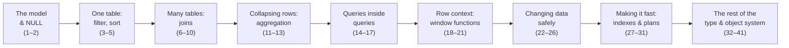

# Foundations

The SQL common core — the part every job needs, whether you go on to build an API
or a data warehouse. Work through it in order; each topic assumes the ones above
it.

Every page: the mechanism from zero, a **hand-trace** on a handful of real rows,
a **runnable script** that recreates those rows and runs every query, and four
**Build → Break → Fix → Why** scenarios.

## The path

### The model
1. [The relational model & what a query engine does](/foundations/the-relational-model)
2. [Data types, `NULL` & three-valued logic](/foundations/data-types-null-and-three-valued-logic)

### One table
3. [Logical query processing order](/foundations/logical-query-processing-order)
4. [Filtering rows: `WHERE`, `IN`, `BETWEEN`, `LIKE`, `CASE`](/foundations/filtering-rows)
5. [Sorting & limiting: `ORDER BY`, `NULLS`, `LIMIT`/`OFFSET`](/foundations/sorting-and-limiting)

### Many tables
6. [`INNER JOIN`: the cross-product-and-filter model](/foundations/inner-join)
7. [Outer joins: `LEFT`, `RIGHT`, `FULL` & `NULL` semantics](/foundations/outer-joins)
8. [Self-joins & `CROSS JOIN`](/foundations/self-joins-and-cross-joins)
9. [`ON` vs `WHERE`: predicate placement in joins](/foundations/on-vs-where)
10. [Semi-joins & anti-joins (`EXISTS`, the `NOT IN` trap)](/foundations/semi-joins-and-anti-joins)

### Collapsing rows
11. [Aggregation & `GROUP BY`](/foundations/group-by-and-aggregation)
12. [`HAVING` vs `WHERE`](/foundations/having-vs-where)
13. [`GROUPING SETS`, `ROLLUP`, `CUBE`](/foundations/grouping-sets-rollup-cube)

### Queries inside queries
14. [Subqueries: scalar, row, table](/foundations/subqueries)
15. [Correlated subqueries & `EXISTS`](/foundations/correlated-subqueries-and-exists)
16. [Common Table Expressions (`WITH`)](/foundations/common-table-expressions)
17. [Recursive CTEs: hierarchies & graphs](/foundations/recursive-ctes)

### Row context
18. [Window functions: `PARTITION BY` & ranking](/foundations/window-functions-partitioning-and-ranking)
19. [Window frames: running totals & moving averages](/foundations/window-frames)
20. [Set operations: `UNION`, `INTERSECT`, `EXCEPT`](/foundations/set-operations)
21. [`DISTINCT` & `DISTINCT ON`](/foundations/distinct-and-distinct-on)

### Changing data safely
22. [Modifying data: `INSERT`, `UPDATE`, `DELETE`, `RETURNING`](/foundations/modifying-data)
23. [Upsert & `MERGE`: `INSERT ... ON CONFLICT`](/foundations/upsert-and-merge)
24. [Constraints & keys: PK, FK, `UNIQUE`, `CHECK`](/foundations/constraints-and-keys)
25. [Transactions & ACID](/foundations/transactions-and-acid)
26. [Isolation levels & MVCC](/foundations/isolation-levels-and-mvcc)

### Making it fast
27. [Indexes from first principles: the B-tree](/foundations/indexes-and-the-b-tree)
28. [Index types & when each wins](/foundations/index-types)
29. [Reading query plans: `EXPLAIN` & `EXPLAIN ANALYZE`](/foundations/reading-query-plans)
30. [Query optimization: sargability, statistics, join algorithms](/foundations/query-optimization)
31. [Views & materialized views](/foundations/views-and-materialized-views)

### The rest of the type & object system
32. [Dates, times, intervals & time zones](/foundations/dates-times-and-time-zones)
33. [Text: pattern matching, regex & full-text basics](/foundations/text-pattern-matching-and-regex)
34. [JSON & JSONB](/foundations/json-and-jsonb)
35. [Arrays](/foundations/arrays)
36. [LATERAL joins & set-returning functions](/foundations/lateral-joins)
37. [Generated columns, domains & custom types](/foundations/generated-columns-domains-and-types)
38. [Triggers & PL/pgSQL basics](/foundations/triggers-and-plpgsql)
39. [Roles, privileges & row-level security](/foundations/roles-privileges-and-row-level-security)
40. [Bulk loading: `COPY`, `\copy` & staging tables](/foundations/bulk-loading-and-copy)
41. [Numeric precision, money & rounding](/foundations/numeric-precision-money-and-rounding)

## When you're done

You should be able to read an unfamiliar query and predict what it returns, which
rows it touches, where it will be slow, and how it will behave under a
concurrent write. That's the point of this track — everything in
[Backend](/backend/) and [Data Engineering](/data-engineering/) builds on it.
